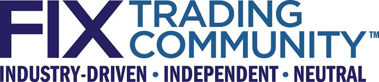
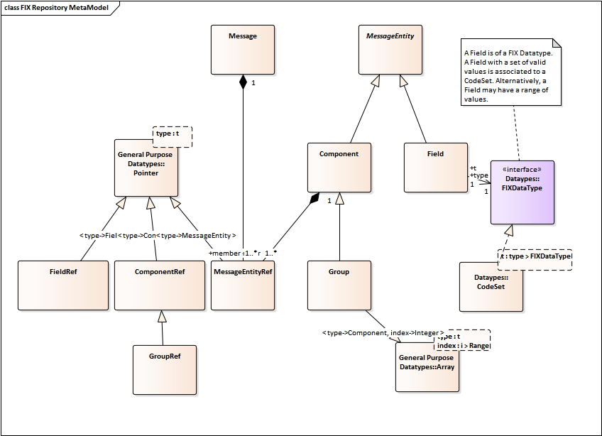

FIX Orchestra Technical Specification

Release Candidate 2

**THIS DOCUMENT IS A RELEASE CANDIDATE FOR A PROPOSED FIX TECHNICAL STANDARD. A RELEASE CANDIDATE HAS BEEN APPROVED BY THE GLOBAL TECHNICAL COMMITTEE AS AN INITIAL STEP IN CREATING A NEW FIX TECHNICAL STANDARD. POTENTIAL ADOPTERS ARE STRONGLY ENCOURAGED TO BEGIN WORKING WITH THE RELEASE CANDIDATE AND TO PROVIDE FEEDBACK TO THE GLOBAL TECHNICAL COMMITTEE AND THE WORKING GROUP THAT SUBMITTED THE PROPOSAL. THE FEEDBACK TO THE RELEASE CANDIDATE WILL DETERMINE IF ANOTHER REVISION AND RELEASE CANDIDATE IS NECESSARY OR IF THE RELEASE CANDIDATE CAN BE PROMOTED TO BECOME A FIX TECHNICAL STANDARD DRAFT.**

**
**

DISCLAIMER

THE INFORMATION CONTAINED HEREIN AND THE FINANCIAL INFORMATION EXCHANGE PROTOCOL (COLLECTIVELY, THE "FIX PROTOCOL") ARE PROVIDED "AS IS" AND NO PERSON OR ENTITY ASSOCIATED WITH THE FIX PROTOCOL MAKES ANY REPRESENTATION OR WARRANTY, EXPRESS OR IMPLIED, AS TO THE FIX PROTOCOL (OR THE RESULTS TO BE OBTAINED BY THE USE THEREOF) OR ANY OTHER MATTER AND EACH SUCH PERSON AND ENTITY SPECIFICALLY DISCLAIMS ANY WARRANTY OF ORIGINALITY, ACCURACY, COMPLETENESS, MERCHANTABILITY OR FITNESS FOR A PARTICULAR PURPOSE. SUCH PERSONS AND ENTITIES DO NOT WARRANT THAT THE FIX PROTOCOL WILL CONFORM TO ANY DESCRIPTION THEREOF OR BE FREE OF ERRORS. THE ENTIRE RISK OF ANY USE OF THE FIX PROTOCOL IS ASSUMED BY THE USER.

NO PERSON OR ENTITY ASSOCIATED WITH THE FIX PROTOCOL SHALL HAVE ANY LIABILITY FOR DAMAGES OF ANY KIND ARISING IN ANY MANNER OUT OF OR IN CONNECTION WITH ANY USER'S USE OF (OR ANY INABILITY TO USE) THE FIX PROTOCOL, WHETHER DIRECT, INDIRECT, INCIDENTAL, SPECIAL OR CONSEQUENTIAL (INCLUDING, WITHOUT LIMITATION, LOSS OF DATA, LOSS OF USE, CLAIMS OF THIRD PARTIES OR LOST PROFITS OR REVENUES OR OTHER ECONOMIC LOSS), WHETHER IN TORT (INCLUDING NEGLIGENCE AND STRICT LIABILITY), CONTRACT OR OTHERWISE, WHETHER OR NOT ANY SUCH PERSON OR ENTITY HAS BEEN ADVISED OF, OR OTHERWISE MIGHT HAVE ANTICIPATED THE POSSIBILITY OF, SUCH DAMAGES.

**DRAFT OR NOT RATIFIED PROPOSALS** (REFER TO PROPOSAL STATUS AND/OR SUBMISSION STATUS ON COVER PAGE) ARE PROVIDED "AS IS" TO INTERESTED PARTIES FOR DISCUSSION ONLY. PARTIES THAT CHOOSE TO IMPLEMENT THIS DRAFT PROPOSAL DO SO AT THEIR OWN RISK. IT IS A DRAFT DOCUMENT AND MAY BE UPDATED, REPLACED, OR MADE OBSOLETE BY OTHER DOCUMENTS AT ANY TIME. THE FIX GLOBAL TECHNICAL COMMITTEE WILL NOT ALLOW EARLY IMPLEMENTATION TO CONSTRAIN ITS ABILITY TO MAKE CHANGES TO THIS SPECIFICATION PRIOR TO FINAL RELEASE. IT IS INAPPROPRIATE TO USE FIX WORKING DRAFTS AS REFERENCE MATERIAL OR TO CITE THEM AS OTHER THAN “WORKS IN PROGRESS”. THE FIX GLOBAL TECHNICAL COMMITTEE WILL ISSUE, UPON COMPLETION OF REVIEW AND RATIFICATION, AN OFFICIAL STATUS ("APPROVED") OF/FOR THE PROPOSAL AND A RELEASE NUMBER.

No proprietary or ownership interest of any kind is granted with respect to the FIX Protocol (or any rights therein).

Copyright 2013-2017 FIX Protocol Ltd., all rights reserved.

FIX Orchestra by [FIX Protocol Ltd.](http://www.fixtradingcommunity.org/) is licensed under a [Creative Commons Attribution-NoDerivatives 4.0 International License](http://creativecommons.org/licenses/by-nd/4.0/).
Based on a work at <https://github.com/FIXTradingCommunity/fix-orchestra>

**Document History**

| Revision            | Date      | Author        | Revision comments |
|---------------------|-----------|---------------|-------------------|
| Release Candidate 2 | 26 jan 17 | Don Mendelson | Initial draft     |
|                     |           |               |                   |
|                     |           |               |                   |
|                     |           |               |                   |
|                     |           |               |                   |

**
**

Introduction
============

Objectives
----------------------------------------------------------------------------------------------------------------------------------------------------------------

FIX Orchestra was conceived as **machine readable rules of engagement** between counterparties. As such, it is a standard for exchange of metadata about the behavior of FIX applications. Orchestra is intended to cut time to onboard counterparties.

The contents of Orchestra files are machine readable (that is, processed as data) and may include:

-   Message structure by each scenario, implemented as an extension of FIX Repository.

-   Accepted values of enumerations by message scenario

-   Workflow: when I send this message type under this condition, what can I expect back?

-   How external states affect messages, e.g. market phases

-   Express a condition such as for a conditionally required field using a Domain Specific Language (DSL)

-   Document and exchange the Algorithmic Trading Definition Language (FIXatdl) files associated with a FIX service offering

-   FIX session identification and transport configuration

From the contents, firms and vendors will be enabled to develop tools to automate configuration of FIX engines and applications, and generation of code, test cases, and documentation. The various aspects are not an all-or-nothing proposition, however. Users may implement only the features that they find most beneficial, and add features as needed.

Orchestra supports but does not change FIX protocol itself in any way, nor does it obsolete existing FIX engines or tools.

Design principles
-----------------

As a standard for delivering metadata about FIX messages and application behavior, Orchestra relies on technologies that are well supported across all popular platforms and programming languages, particularly XML and XML Schema.

Since Orchestra is primarily used at design time or compile time rather than run time, high performance characteristics such as low latency are not a major concern.

In future, Orchestra may be ported to alternative technologies, particularly Web Ontology Language (OWL). However, the primary XML technologies will continue to be supported for the foreseeable future.

Glossary
-------------------------------------------------------------------------------------------------------------------------------------------------

**Datatype** – the value space of a data element, possibly including enumerated values, precision or range. Some types have additional attributes, e.g. epoch and time zone of a date. Value space is at the application layer (layer 7 of the OSI model).

**Encoding** – a wire format for data representation. Also known as lexical space or the presentation layer (layer 6) in a protocol stack.

**Extension Pack (EP)** – an interim publication between major versions of a FIX standard.

L**exical space** – the representation of a data element. It belongs to the presentation layer. For character based encodings, it is defined as a particular sequence of characters. For binary encodings, it may involve mapping to primitive data types supported by computing platforms.

**Pedigree** – recorded history of an artifact

**Provenance** – a record of ownership of an artifact

**Scenario**—a use case of a message type

**Session protocol** – a protocol concerned with the reliable delivery of messages over a transport. Layer 5 in the OSI protocol model.

**Tag** – a unique numeric identifier of a message element, especially a field identifier.

**Value space** – the type of a data element and its possible range of values. Value space belongs to the application layer (semantics) and should be independent of encoding (presentation layer) and programming language.

**XML schema**–defines the elements and attributes that may appear in an XML document. The Orchestra schema is defined in W3C (XSD) schema language since it is the most widely adopted format for XML schemas.

Documentation
-----------------------------------------------------------------------------------------------------------

### Specification terms

These key words in this document are to be interpreted as described in [Internet Engineering Task Force RFC2119](http://www.apps.ietf.org/rfc/rfc2119.html). These terms indicate an absolute requirement for implementations of the standard: "**must**", or "**required**".

This term indicates an absolute prohibition: "**must not**".

These terms indicate that a feature is allowed by the standard but not required: "**may**", "**optional**". An implementation that does not provide an optional feature must be prepared to interoperate with one that does.

These terms give guidance, recommendation or best practices: "**should**" or "**recommended**". A recommended choice among alternatives is described as "**preferred**".

These terms give guidance that a practice is not recommended: "**should not**" or "**not recommended**".

### Document format

In this document, these formats are used for technical specifications and data examples.

XML element and attribute names as well as FIX field and message names appear in this font: codeSet

This is a sample XML snippet:

> &lt;fixr:field id="59" name="TimeInForce" type="TimeInForceCodeSet"/&gt;

References
----------

### Related FIX Standards

For FIX semantics, see the current FIX message specification, which is currently [FIX 5.0 Service Pack 2](http://www.fixtradingcommunity.org/pg/structure/tech-specs/fix-version/50-service-pack-2) with Extension Packs.

### Dependencies on other standards

Orchestra imports [Dublin Core XML schemas version 2008-02-11](http://dublincore.org/schemas/xmls/) for artifact provenance. Dublin Core is standardized as IETF RFC 5013 and ISO 15836.

XML 1.1 schema standards are located here [W3C XML Schema](http://www.w3.org/XML/Schema.html#dev)

Metamodel
=========

One conceptual metamodel governs all representations of FIX Orchestra and Repository knowledge bases. The XML schema and any other representations that may be developed in future, such as semantic ontologies, should be considered implementations of this common metamodel.

The metamodel presented does not strictly conform to the UML Meta-Object Facility architecture.

Message structures
------------------

The UML metamodel depicted below is a conceptual view of message structures.

### Message structure abstractions

**Field** – carries a specific business meaning (semantics) as described in FIX specifications or other protocol. A pointer to a field is a **fieldRef**. The data domain of a field is either a datatype or a code set.

**Datatype** – the value space of a class of fields. FIX has about 20 datatypes.

**Code set** – a set of valid values of a field. They must all be of the same datatype.

C**omponent** – a sequence of fields and nested components. There are two types of components, common block and repeating group. A common block is a component designed to specified once in detail but reused in multiple message types by reference. A pointer to a component is **componentRef**.

**Group, or repeating group** – like a common block but with one additional feature: it represents an *array of* blocks to be sent on the wire. A pointer to a group is **groupRef**.

**Message** – a unit of information sent on the wire between counterparties. A message is composed of components and fields. A pointer to a message is a **messageRef**.

### General Purpose Datatypes

Pointer and array abstractions are defined by standard ISO 11404. The code set abstraction is described in that standard as “state” type.

Orchestra and Repository XML Schema
===================================

XML Schema (XSD)
----------------

FIX Orchestra and Repository 2016 Edition share a common XML schema. The two forms are only distinguished by usage. If a file only contains message structures and message documentation, it may be referred to as a Repository file. If it additionally contains work flow, state variables, conditional logic and so forth, then it is called an Orchestra file. In other words, Orchestra is a superset of Repository features.

### Conformance

All published Repository and Orchestra files **must** conform to the standard XML schema. This can be validated with common XML parsers and related tools.

### Schema location

The XML schema is currently available in GitHub project fix-orchestra module [repository2016](https://github.com/FIXTradingCommunity/fix-orchestra/tree/master/repository2016). Upon promotion to draft standard, it will be made available at a URL consistent with its XML namespace.

### Root element

The root element an Orchestra XML file is &lt;repository&gt;. This snippet shows that element with required namespaces:

> &lt;fixr:repository xmlns:dcterms="http://purl.org/dc/terms/" xmlns:fixr="http://fixprotocol.io/2016/fixrepository" xmlns:xsi="http://www.w3.org/2001/XMLSchema-instance" xsi:schemaLocation="http://fixprotocol.io/2016/fixrepository FixRepository2016.xsd"&gt;

### Supplementary documentation

See the separate document “FixRepository2016.doc” for a detailed technical reference for the Orchestra and Repository XML schema. The remainder of this section serves as an overview and explains motivations for the design.

### Protocol relationship

The schema was primarily designed to describe metadata about FIX protocols. However, it was also intended to be generic enough to work with other common financial industry protocols, especially when FIX is used in combination with other protocols, or a translation must be performed between protocols.

Usage should be supported for all phases of financial industry workflows, including pre-trade, trade, and post-trade flows.

Content ownership and history
-----------------------------

### Provenance

The &lt;metadata&gt; element is used to identify a particular Orchestra file and the issuer of that file. It can contain any of the elements defined by the Dublin Core XML schema. Recommended elements include publisher, date, and rights.

### Pedigree

Most message elements in the schema support a complete history of creation, change and deprecation with support of attribute group entityAttribGrp. Each historical event is qualified by its protocol version and optionally, extension pack (EP), an interim publication between major versions.

Code element with pedigree

> &lt;code value="3" symbolicName="LocalCommission" added="FIX.4.0" deprecated="FIX.5.0SP2" deprecatedEP="204"/&gt;

Features for document and FIXML generation
------------------------------------------

The XML schema retains features that have long been used to generate FIX documentation and other outputs. These elements are optional.

### Abbreviations

The &lt;abbreviations&gt; element tree contains short names for FIX element names. One use is to shorten element names in FIXML schema generation.

### Categories

The &lt;categories&gt; element tree is used to associate FIX elements to business classifications, such as order handling, market data, and so forth, for documentation generation. Also, categories are used to organize FIXML schema files.

### Sections

The &lt;sections&gt; element tree names document volumes. Traditionally, they have been organized around pre-trade, trade, and post-trade information flows.

### Metadata about any element

The schema provides features to provide metadata about almost any element. All such metadata appears under element &lt;annotation&gt;. There is no limit to the number of metadata entries per &lt;annotation&gt; element.

#### Documentation

A &lt;documentation&gt; element can carry any description of its ancestor element. The content (text node) may be of any format, such as HTML5. The XML parser is instructed not to validate the free-form content. Tools such as XSLT may be used to extract documentation from an Orchestra file and compile external documents.

Multiple languages can be supported by specifying the language of each element in its langId attribute. Also, multiple categories of documentation are supported by populating the purpose attribute. Suggested values of purpose include "SYNOPSIS", "ELABORATION", "EXAMPLE", and "DISPLAY".

Field element with documentation

> &lt;fixr:field id="45" name="RefSeqNum"&gt;
>
> &lt;fixr:annotation&gt;
>
> &lt;fixr:documentation langId="en-us" purpose="SYNOPSIS"&gt;Reference message sequence number&lt;/fixr:documentation&gt;
>
> &lt;/fixr:annotation&gt;
>
> &lt;/fixr:field&gt;

#### Appinfo

The &lt;appinfo&gt; element is similar to &lt;documentation&gt; in that it can support multiple languages and multiple purposes. It has an additional attribute, specURL, to cross-reference external documentation.

Datatypes
---------

### FIX datatypes

FIX fields are categorized into roughly 20 datatypes. A datatype should be defined in terms of its value space, the range of its possible values, not in terms of its lexical space, its encoding format. In fact, a FIX datatype may be mapped to any number of wire formats. (See datatype mappings section below.)

Some fields are specified as set of valid values. This is known as code set, and it can be thought of as a specialized datatype. (See Code set section below.)

Each FIX datatype is described by a &lt;datatype&gt; element, a child of &lt;datatypes&gt;. A datatype may optionally inherit properties from a type specified by the baseType attribute. For example, Qty datatype, used by fields like OrderQty, has baseType of float, a more generic FIX datatype.

Generally, FIX datatypes need be defined only once and are copied from the baseline standard.

### Datatype mappings

A &lt;datatype&gt; element may contain &lt;mappedDatatype&gt; elements corresponding to any number of type systems. Type systems include XML, SBE, GPB, JSON, and ISO 11404, a generic type taxonomy. An XML schema mapping is obviously needed by FIXML.

The standard attribute of &lt;datatype&gt; tells which type system the mapping is for. Its base attribute tells what the FIX datatype maps to in the particular standard. For example, FIX type Qty maps to XML schema type xs:decimal.

The ISO/IEC 11404 General Purpose Datatypes standard contains a taxonomy of language-independent types and enumerates their characteristics. One of the benefits of following this standard is that it will be easier to map FIX data types to other message standards, such as ISO 20022 (SWIFT). Rather than creating numerous one-off mappings to other type systems, is it likely more efficient to map each to ISO 11404 once, and then compare mappings in an associative model to identify the commonalities. (The XML schema standard claims to derive its datatypes from ISO 11404, but mapping to the generic standard is more precise and comprehensive than filtering it through the XML interpretation.)

The lower and upper bounds of a bounded datatype may be set with minInclusive and maxExclusive attributes.

A FIX datatype with mappings to XML schema and General Purpose Datatypes

> &lt;fixr:datatype name="SeqNum" baseType="int"&gt;
>
> &lt;fixr:mappedDatatype standard="XML" base="xs:positiveInteger"/&gt;
>
> &lt;fixr:mappedDatatype standard="ISO11404" base="Ordinal"/&gt;
>
> &lt;/fixr:datatype&gt;

Code sets
---------

A code set contains the valid values of a data element. Each unique valid value is called a code. In the terminology of ISO 11404, such a data element is called a “state”. It has a finite collection of valid values. (This is distinguished from an enumeration, in which the order of values matters. In a state, each of the values must be unique, but order is not significant. Hence, the values collection is a set.)

In FIX and other protocols, many fields may share a code set. For example, the SecurityIDSource and UnderlyingSecurityIDSource fields share the same valid values, or code set.

A code set has an underlying datatype to tell its range of possible values. Codes may legally be of any type listed in the &lt;datatypes&gt; section, but typically are int, char or String datatypes in FIX. In an XML file, a code value is presented as a string, but it should be actually transmitted in the correct encoding for the datatype of the code set. For example, if the datatype of a code set was “int”, value “27” should be transmitted in the correct wire format for integer 27, not as character “2” and then character “7”.

A &lt;codeSets&gt; element contains any number of &lt;codeSet&gt; child elements. The schema allows multiple instances of &lt;codeSets&gt; containers, each with a unique name attribute. They may be used organize code sets for different realms, such as for different protocols or internal versus external code sets (see below).

### Unique names

The names of code sets and datatypes share a common namespace and must be unique within a schema.

### Internal code sets

Internal code sets are maintained in a Repository or Orchestra file by the issuer. The &lt;code&gt; elements that belong to the code set are listed explicitly.

#### Codes

An internal &lt;codeSet&gt; is a container for &lt;code&gt; elements. In the schema, each code has a symbolicName attribute to tell its logical name, and a value attribute to tell its value on the wire.

Codes may be added to a code set over time, or existing codes may be deprecated. The history of codes within a code set may be recorded using the pedigree attributes of attribute group entityAttribGrp.

Codes may be documented with an &lt;annotation&gt; element tree.

An internal code set

> &lt;fixr:codeSet name="SettlInstSourceCodeSet" type="char" &gt;
>
> &lt;fixr:code value="1" symbolicName="BrokerCredit" added="FIX.4.1"/&gt;
>
> &lt;fixr:code value="2" symbolicName="Institution" added="FIX.4.1"/&gt;
>
> &lt;fixr:code value="3" symbolicName="Investor" added="FIX.4.3"/&gt;
>
> &lt;/fixr:codeSet&gt;

### External code sets

In some cases, FIX shares code sets with other protocols. Examples include currency, language, and country codes defined by another standard. This is called an external code set because the valid values are maintained by the external standard, not within the Repository or Orchestra file. To provide a reference to an external standard, use &lt;codeSet&gt; attribute specUrl. Additional references can be supplied with &lt;annotation&gt; elements.

In the case of an external code set, &lt;code&gt; elements are not listed in the Orchestra file.

An external code set. Currency is defined as a FIX datatype with valid values defined by standard ISO 4217.

> &lt;fixr:codeSet name="CurrencyCode" type="Currency" specUrl=" http://www.iso.org/iso/home/store/catalogue\_ics/catalogue\_detail\_ics.htm?csnumber=64758"/&gt;

Fields
------

A field carries a specific business meaning (semantics) as described in FIX specifications or other protocol. In the schema, a &lt;field&gt; element is contained by parent element &lt;fields&gt;. There is a single &lt;fields&gt; container, no matter how may versions of FIX protocol are described in a file. By using one list for all protocol versions, duplication is avoided. The collection of fields should be thought of as an append-only list; the id of a deprecated field must not be reused. The pedigree attributes of attribute group entityAttribGrp are used to tell the history of a field, including the protocol version in which it was added.

In FIX, a field has two unique identifiers, numeric id, also known as tag, and a descriptive string name. Both id and name must be unique among all message elements in a schema. Although the two keys may be considered duplication, both attributes must be used in all field references, and it is an error if the values are inconsistent.

Like other message elements, a field may be documented with an &lt;annotation&gt; element tree as described above. Also, the baseCategory attribute may be used to categorize fields. There are several more optional attributes which are described in the message structure section below.

### Data domain of a field

Every field must have data domain of either a &lt;datatype&gt; name or more specifically, a collection of valid values specified by a &lt;codeSet&gt; reference. In either case, the domain of a field is specified in its type attribute. The attribute type refers to either a &lt;datatype&gt; element or a &lt;codeSet&gt; element by its name attribute. In the case of a &lt;codeSet&gt;, there is a level of indirection to its type attribute to arrive at a &lt;datatype&gt;.

A field with a code set and another with a datatype domain

> &lt;fixr:field id="59" name="TimeInForce" type="TimeInForceCodeSet"/&gt;
>
> &lt;fixr:field id="60" name="TransactTime" type="UTCTimestamp"/&gt;

### Data fields

A field of data datatype is variable length. In FIX tag=value encoding, the length of such a field is prefixed by a separate field of type Length. In other encodings, the length is implicit in the presentation protocol. For data fields, the associated Length field is referenced by lengthId and lengthName attributes, references to its id and name attributes, respectively. Both keys must be supplied if field datatype is data.

A data field and its corresponding Length field

> &lt;field added="FIX.2.7" id="95" name="RawDataLength" type="Length"/&gt;
>
> &lt;field added="FIX.2.7" id="96" name="RawData" type="data" lengthId="95" lengthName="RawDataLength"/&gt;

### Overridable and fixed field attributes

Some attributes of a field, such as minimum and maximum values and length, may be overridden for a particular usage in the message structure that contains a field reference. However, the key identifiers id and name as well as type attribute may not be overridden. It is possible to override which codes of a code set are supported in a particular scenario, however. See the message structure section below.

Message structures
------------------

### Protocol versions

The XML schema supports containment of multiple protocol versions in a single file. A party may support multiple FIX versions, or one file may contain both application messages and session protocol messages.

A &lt;protocol&gt; element contains components, messages and actors. Its version attribute tells the version of FIX or other protocol that is applies to. The optional specUrl attribute supplies the URI of the protocol specification. The URI is not required to point to an programmatic artifact such as an XML schema directly. Rather, it may be the address of a web page that contains further cross-references.

### Components

A component is a sequence of fields and nested components. There are two types of components, common blocks and repeating groups. Both types are contained by the &lt;components&gt; parent element.

#### Component identifiers

Like a field, a component has a numeric id attribute and a string name attribute. For all references to a component, the two key attributes must be consistent.

Also, like a field, a component can be annotated for documentation and carries pedigree attributes of attribute group entityAttribGrp.

#### Common block

A common block component is designed to specified once in detail but reused in multiple message types by reference. An example of a common block is “Instrument”. It is a collection of the possible fields describing an instrument to be traded, and it is used in many FIX messages. A common block is implemented as a &lt;component&gt; element in the schema.

Rules about order of fields or nested components, if any, depend upon the presentation protocol. Since Orchestra supports multiple encodings, the order of fields in an Orchestra file is not guaranteed to match the order on the wire.

#### Repeating group

A repeating group is like a common block but with one additional feature: it represents an *array of* blocks to be sent on the wire. In FIX tag=value encoding, a counter of datatype NumInGroup precedes the array when transmitted. In other encodings, such as FIXML, the array is implicit in the presentation protocol.

A repeating group is specified by a &lt;group&gt; element. It has attributes to specify the associated NumInGroup field by id and name, numInGroupId and numInGroupName, respectively. As with any field reference, both keys must be populated and must be consistent with the referenced field.

Limits on the size of a repeating group may optionally be specified with implMinOccurs and implMaxOccurs attributes. If those attributes are not present, then the repeating has unbound size.

A repeating group with member fields and reference to NumInGroup

> &lt;fixr:group id="2096" added="FIX.4.4" name="UndlyInstrumentPtysSubGrp" numInGroupId="1062" numInGroupName="NoUndlyInstrumentPartySubIDs" category="Common"&gt;
>
> &lt;fieldRef id="1063" name="UnderlyingInstrumentPartySubID" added="FIX.4.4"/&gt;
>
> &lt;fieldRef id="1064" name="UnderlyingInstrumentPartySubIDType" added="FIX.4.4"/&gt;
>
> &lt;/fixr:group&gt;

#### Component members

A component may contain reference elements of three types in any combination. A component must contain at least one member.

-   A &lt;fieldRef&gt; element represents a field in a block or repeating group. It is a reference to a &lt;field&gt; element within the &lt;fields&gt; container. The id and name attributes of the reference must match a &lt;field&gt; consistently.

-   A &lt;componentRef&gt; element represents a nested component. There is no limit in the schema to the level of nesting, although a presentation protocol may have rules about it, and there may be practical limits. The reference must match the referenced &lt;component&gt; on both id and name attributes. The referenced &lt;component&gt; must be contained within the same &lt;protocol&gt;/&lt;components&gt; ancestor.

-   A &lt;groupRef&gt; element similarly refers to a nested &lt;group&gt; repeating group element. Limits of the size of particular instance of a repeating group may be overridden by setting implMinOccurs and implMaxOccurs attributes on the &lt;groupRef&gt; element.

A component with two fields and a nested repeating group

> &lt;fixr:component name="InstrumentExtension" id="1004" category="Common" added="FIX.4.4"&gt;
>
> &lt;fixr:fieldRef id="668" name="DeliveryForm" added="FIX.4.4"/&gt;
>
> &lt;fixr:fieldRef id="869" name="PctAtRisk" added="FIX.4.4"/&gt;
>
> &lt;fixr:groupRef id="2074" name="AttrbGrp" added="FIX.4.4"/&gt;
>
> &lt;/fixr:component&gt;

#### In-line component definition

Normally, fields, components and groups are listed by reference in order to avoid duplication of their attributes. In the case of a field, it may be used in many messages, so a file generally only defines a &lt;field&gt; once in all its glory, while each usage refers to it with a simpler &lt;fieldRef&gt;. Likewise, for components and groups.

However, the schema allows for in-line definition of a &lt;field&gt; contained by a parent &lt;component&gt;. This may be simpler when the usage is known to be a singleton, and therefore, there is no duplication of attributes.

### Presence

Each of the members of a component or message, namely &lt;fieldRef&gt;, &lt;componentRef&gt; or &lt;groupRef&gt;, have a presence attribute. The possible values of presence are:

-   **required**—the field or component must always be present in a message.

-   **optional**—the field or component is optional.

-   **conditional**—the field or component is conditionally required. See below.

-   **forbidden**—the element is forbidden in a particular scenario described (but may be allowed in others). Scenarios are described below.

-   **ignored**—the element is permitted but is not processed by the receiving party, and thus, no validation is performed on it.

-   **constant**—the field has a constant value.

### Constant field value

A field may be set to a constant value. A specific value of a field is often useful to distinguish scenarios, or use cases for a message type. For example, values of ExecType distinguish various scenarios of ExecutionReport. Also, if a presentation protocol supports constants, a constant field need not be transmitted on the wire.

A constant field. SecurityIDSource is always code “1” (CUSIP).

> &lt;fixr:fieldRef id="22" name="SecurityIDSource" presence="constant" value="1"/&gt;

### Default value of an optional field

For an optional field, a default value may be specified if the sender does not provide the field.

An optional field with default value. TimeInForce default is ‘0’ (Day).

> &lt;fixr:fieldRef id="59" name="TimeInForce" presence="optional" value="0"/&gt;

### Conditionally required field

The presence of a conditionally required field depends upon other fields in a component or message. For example, StopPx is required when OrdType is Stop or StopLimit. If OrdType has any other value like Limit or Market, then StopPx is not required.

The condition that tells when a conditionally required field is required is contained by a &lt;rule&gt; element tree under a &lt;fieldRef&gt;. A &lt;rule&gt; element may contain an override of presence as well as certain other field attributes. Each rule is specified by a &lt;when&gt; element that gives the condition for the override. The XML content (text node) of the &lt;when&gt; element is a conditional expression that follows a grammar described in the conditional expressions section below. The attribute override such as presence=″required″ attribute is applied to the &lt;when&gt; element.

Rules for a conditionally required field

> &lt;fixr:fieldRef id="99" name="StopPx" presence="conditional"&gt;
>
> &lt;fixr:rule name="StopOrderRequiresStopPx" presence="required"&gt;
>
> &lt;fixr:when&gt;OrdType == Stop&lt;/fixr:when&gt;
>
> &lt;/fixr:rule&gt;
>
> &lt;fixr:rule name="LimitOrderForbidsStopPx" presence="forbidden"&gt;
>
> &lt;fixr:when&gt;OrdType != Stop&lt;/fixr:when&gt;
>
> &lt;/fixr:rule&gt;
>
> &lt;/fixr:fieldRef&gt;

### Message

A message in an Orchestra file describes a unit to be sent on the wire between counterparties.

Like a &lt;component&gt;, a &lt;message&gt; element has id and name attributes. It also has msgType attribute, a short name. In tag=value encoding, msgType is the value of tag 35.

Message has two additional attributes, context and originator that are used with workflow. Suffice it to say for now that context is the name of a scenario, a particular usage of a message type.

#### Message structure

A &lt;protocol&gt;/&lt;messages&gt; element contains any number of child &lt;message&gt; elements. From the perspective of the XML schema, a &lt;message&gt; is very similar to a &lt;component&gt;; they contain the same member types and share most attributes. However, &lt;message&gt; is a top-level entity only; it cannot be contained by other message parts, nor can messages be nested.

Unlike &lt;component&gt;, the parts of a message are contained by a child &lt;structure&gt; element, which in turn holds &lt;fieldRef&gt;, &lt;componentRef&gt; and &lt;groupRef&gt; elements.

A message structure with a field, nested components, and a nested repeating group

> &lt;fixr:message name="TradingSessionList" id="100" msgType="BJ" category="MarketStructureReferenceData" section="PreTrade"&gt;
>
> &lt;fixr:structure&gt;
>
> &lt;fixr:componentRef id="1024" name="StandardHeader" presence="required"/&gt;
>
> &lt;fixr:componentRef id="1057" name="ApplicationSequenceControl"/&gt;
>
> &lt;fixr:fieldRef id="335" name="TradSesReqID" /&gt;
>
> &lt;fixr:groupRef id="2099" name="TrdSessLstGrp" presence="required"/&gt;
>
> &lt;fixr:componentRef id="1025" name="StandardTrailer" presence="required"/&gt;
>
> &lt;/fixr:structure&gt;
>
> &lt;/fixr:message&gt;

#### Message structure extension

Message structures commonly vary with scenario or use case. For example, an ExecutionReport might look quite different in its execution use case versus a cancel-confirmation use case. To avoid duplication of message structures, the XML schema supports declaration of a base structure that is common to all use cases with any number of extensions. The extended structures inherit the base message structure. The attribute that gives names a scenario is context. If no context is explicitly given, it defaults to “base”.

Inheritance is specified with the attribute extends. It gives the name of another context to inherit from, possibly “base”. When extending another context, the message structure of the inherited context is assumed to be included. Only added fields need be listed in the &lt;structure&gt; of the extended message context. Logically, the extended structure is a conjoined collection; it does not imply anything about the order of fields in the derived message.

#### Responses

Aside from &lt;structure&gt;, &lt;message&gt; has another child element called &lt;responses&gt;; it is explained in the workflow section below.

Expressions
-----------

### Conditional expressions

Conditional expressions are rules that are expressed in Domain Specific Language (DSL). They are evaluated by substituting actual values from a message and other state information for tokens in the expression. A conditional expression is of Boolean type. That is, it evaluates true or false. If true, it determines the value of another attribute or that some action should take place, such as sending a certain response message.

Conditional expressions are used in Orchestra:

-   To tell when a conditionally required field is required (presence=required)

-   To tell when a field attribute aside from presence is overridden, such as setting the range of valid values with minInclusive and maxInclusive attributes. It can even tell when to override the type of a field. For example, the type of SecurityID could be overridden, depending on the value of SecurityIDSource. Some kinds of security IDs are strings while others are numeric.

-   To tell when a specific workflow response should be sent or other action taken

All conditions are declared in the XML content of a &lt;when&gt; element. See the Score DSL section below for details of the grammar.

### Assignment expressions

Assignment expressions are triggered by an action fired from true evaluation of a conditional expression. Assignment expressions are used to alter a state variable that belongs to an actor.

The grammar of assignment expressions is also governed by the Score DSL.

### Field attribute rules

Optionally, a &lt;rule&gt; element may be added as a child to &lt;fieldRef&gt; to control an attribute of a field dynamically. Multiple rules are allowed for the same field reference to affect multiple attributes or to generate different values of an attribute under different conditions.

The attributes of a &lt;fieldRef&gt; that can be controlled by a rule include type and any member of fieldAttribGrp attribute group. That group includes presence and attributes to control the length of a field. A rule about presence tells when a conditionally required field is required.

### Field validation rules

Orchestra has several ways to specify when a field value is valid. One is to set a field’s type to a code set that lists all valid values. Another is to set a valid range using attributes minInclusive and maxInclusive.

More complex rules can be written under a &lt;fieldRef&gt; that reference the values of other fields or the state variables of actors. Rules can be quite dynamic. For example, a market might reject orders with limit price outside a band of some differential above or below the last sale price.

Rule violations can then be captured by a state variable, and if appropriate, an action can be taken, such as sending a reject message. It is important, particular when generating test systems, to capture all violations rather than reacting to the first one encountered. It is recommended to capture all violations in a repeating group variable of an &lt;actor&gt; element. Responses can be defined in the actor to perform actions such as sending a reject message for certain kinds of violations.

A field valuation rule sets a state variable when tripped

> &lt;fixr:fieldRef id="44" name="Price"&gt;
>
> &lt;fixr:rule name="tick" &gt;
>
> &lt;fixr:when&gt;\[syntax to come – price not an even tick\]&lt;/fixr:when&gt;
>
> &lt;fixr:stateRef&gt;\[syntax to come to add a group instance\]&lt;/fixr:stateRef&gt;
>
> &lt;/fixr:rule&gt;
>
> &lt;/fixr:fieldRef&gt;

A state variable to hold rule violations

> &lt;fixr:actor name="validator"&gt;
>
> &lt;fixr:group id="10000" name="ViolationGrp" numInGroupId="10001" numInGroupName="NoViolations"&gt;
>
> &lt;fixr:field id="10002" name="ruleViolated" type="String"&gt;
>
> &lt;/fixr:group&gt;
>
> &lt;/fixr:actor&gt;

### Response conditions

A &lt;when&gt; element with conditional expression is also supported in the &lt;message&gt;/&lt;responses&gt; element tree. See workflow below for usage.

Workflow
--------

Workflow is the behavior of a FIX party with respect to the exchange of messages. For each received message type, one or more possible actions can be specified under the &lt;message&gt;/&lt;responses&gt; element.

Workflow in Orchestra recognizes that there is not always a 1:1 relationship between a FIX MsgType and a use case. Some FIX message types such as ExecutionReport are overloaded for many different meanings. Therefore, messages in Orchestra are identified primarily by their FIX type, but with a qualification for a specific use case. We call each message use case a scenario.

Behavior may depend upon more information than a receive message itself. External state information enters it as well, e.g. the state of an order book. The &lt;actors&gt; element tree provides a place to store such external state information. An actor can also be used to identify the originator of a message.

### Scenarios

A scenario is one use case of a specific message type, as identified by key attributes name and msgType in messageAttribGrp attribute group supported by &lt;message&gt;. A scenario name is stored in the context attribute of &lt;message&gt;. If there is only one use case for a message type, then context need not be populated. It defaults to “base”. Contexts must be unique per message type and it is an error to have more than one &lt;message&gt; element of the same type without a context since they would in effect be duplicates of context “base”.

This standard imposes no naming convention for scenarios. Implementers are free to choose names that are meaningful in their business.

Each scenario is represented by a &lt;message&gt; element, and thus has its own message contents in its &lt;structure&gt; child element and its own &lt;responses&gt; element tree.

#### Mapping a message to a scenario

*This section is non-normative.*

The task of mapping an actual received message to a scenario declaration in Orchestra is left to implementations. The first level of matching is on message the msgType attribute. However, that message type may have several contexts. Pattern matching strategies might include comparing a message to expected required fields, mapping values of a distinguishing field like ExecType to its code set literals, and so forth.

### Actors

An &lt;actor&gt; element represents either a counterparty to a FIX session or an external entity that holds state relevant to application and session behavior. An actor can take actions such as assigning state or transitioning a state machine. If it represents a session counterparty, it can send FIX messages. Also, actions can be time dependent. An Orchestra file may declare any number of actors within the &lt;actors&gt; parent element. The name attribute of an &lt;actor&gt; element must be unique within an Orchestra file.

#### State variables

Actors can hold state variables in the form of FIX fields. That is, each state variable has an id and name for identification and a value of a FIX datatype. Like any field, valid values can be constrained to a code set or range. The datatype or code set is declared in the type attribute, just like any field

If a state variable corresponds to a standard FIX field, it can be declared as a &lt;fieldRef&gt; element child of the &lt;actor&gt;. Alternatively, it can be declared in-line as a &lt;field&gt; element. Additionally, state variables can be organized as components or repeating groups.

A state variable can be tested in a conditional expression or set by an assignment expression.

An actor with state variables

> &lt;fixr:actor name="Market"&gt;
>
> &lt;fixr:fieldRef id="336" name="TradingSessionID"/&gt;
>
> &lt;fixr:fieldRef id="75" name="TradeDate"/&gt;
>
> &lt;/fixr:actor&gt;

#### State machines

A state machine has discrete values called states and defined transitions between states. A state machine is declared in XML as a &lt;states&gt; child element of an &lt;actor&gt;. The &lt;states&gt; element contains any number &lt;state&gt; children, and one initial state of the state machine, as &lt;initial&gt; element. It is an error to declare more than one initial state. Some state changes are allowed and others disallowed; changes can only be made through explicitly declared transitions. A &lt;transition&gt; child of a &lt;state&gt; or &lt;initial&gt; gives the name of the new state of the state machine in its target attribute.

States and transitions must have unique names within a state machine.

The current state of a state machine can be tested by a conditional expression, and a transition can be invoked by an assignment expression.

A state machine for market phases

> &lt;fixr:states name="Phase"&gt;
>
> &lt;fixr:initial name="Closed"&gt;
>
> &lt;fixr:transition name="Reopening" target="Preopen"/&gt;
>
> &lt;/fixr:initial&gt;
>
> &lt;fixr:state name="Halted"&gt;
>
> &lt;fixr:transition name="Resumed" target="Preopen"/&gt;
>
> &lt;/fixr:state&gt;
>
> &lt;fixr:state name="Open"&gt;
>
> &lt;fixr:transition name="Closing" target="Preclose"/&gt;
>
> &lt;/fixr:state&gt;
>
> &lt;fixr:state name="Preopen"&gt;
>
> &lt;fixr:transition name="Opened" target="Open"/&gt;
>
> &lt;/fixr:state&gt;
>
> &lt;fixr:state name="Preclose"&gt;
>
> &lt;fixr:transition name="Closed" target="Closed"/&gt;
>
> &lt;/fixr:state&gt;
>
> &lt;/fixr:states&gt;

#### Timers

Some application layer and session layer behavior is time dependent. An event can fire when a timer expires to affect other states or send a message.

Like a state machine, a &lt;timer&gt; is the child of an &lt;actor&gt;, and it has a name attribute.

### Responses

Responses to a received message can be of these types:

-   A message is sent in reply to the received message

-   A state variable is changed

-   A state machine transition is invoked

-   A timer is started or canceled

Multiple responses can be specified for a given message scenario as children of its &lt;responses&gt; element.

#### Message response

A &lt; messageRef&gt; child of response represents a reply to the received message. Its name, msgType and context attributes are the combined key to a matching &lt;message&gt; to send.

Send a response message

> &lt;fixr:messageRef name="ExecutionReport" msgType="8" context="booked "/&gt;

#### State variable response

A &lt;stateRef&gt; changes the value of one or more state variables belonging to an actor. Its child element &lt;assign&gt; references one or more state variables to change in the form of an assignment expression.

Assign a state variable belonging to actor “participant”

> &lt;fixr:stateRef actor="participant"&gt;
>
> &lt;fixr:assign&gt;[RiskLimitAmount](http://www.fixtradingcommunity.org/FIXimate/FIXimate3.0/latestEP/en/FIX.5.0SP2_EP214/tag1531.html)=15000&lt;/fixr:assign&gt;
>
> &lt;/fixr:stateRef&gt;

#### State machine response

A &lt; transitionRefType&gt; element represents a state machine transition invoked when a message is received. Its statemachine attribute identifies the name of the state machine, and name attribute refers to the name of a &lt;transition&gt; within that state machine.

Invoking a state machine transition: the market resumes after a halt

> &lt;fixr:transitionRef actor="market" stateMachine="phase" name="resume"/&gt;

#### Timer operation response

A &lt;timerRef&gt; element invokes an operation to either start or cancel a timer. The name attribute refers to the name of the timer, operation tells whether to start or cancel, and interval gives the elapsed time. Interval is expressed in the lexical space of XML schema type duration. That type includes the magnitude and time unit of the period in conformance to standard ISO 8601. The &lt;responses&gt; elements represents actions to take when the timer expires. Actions can include sending a message, setting a state variable, or invoking a state machine transition.

Invoking a timer operation: start a timer for 120 seconds. On timer expiration, send a cancel message, provided the order is still open

> &lt;fixr:timerRef actor="trader" name="exposureTimer" operation="START" interval="PT120S"&gt;
>
> &lt;fixr:responses&gt;
>
> &lt;fixr:response&gt;
>
> &lt;fixr:messageRef name="OrderCancelRequest" msgType="F"&gt;
>
> &lt;fixr:when&gt;\[conditional syntax to come\]&lt;/fixr:when&gt;
>
> &lt;/fixr:response&gt;
>
> &lt;fixr:responses&gt;
>
> &lt;/fixr:timerRef&gt;

Score DSL
=========

\[This section to be finalized in Release Candidate 2.\]

Grammar
-------

### Constants

Constants are immutable entities. The following entities should have distinct names to be used in conditional or assignment expressions. A constant cannot be the lvalue of an assignment expression.

-   A code of a code set, designated by its SymbolicName.

<!-- -->

-   Any literal value of a FIX datatype.

### Variable names

Variables are mutable entities. The following entities should have distinct names to be used in conditional or assignment expressions.

-   A field in a received message. A field may belong to a component or repeating group. In the case of a repeating group, expressions may need to refer an indexed entry in the group or set a rule regarding all instances.

-   A field of a message to be sent in a scenario.

-   A field used as a state variable of an actor.

-   The current state of a state machine, belonging to an actor.

-   A timer that belongs to an actor.

### Conditional expressions

Requirements:

-   Relational expression: Compare a field’s value in a received message to a constant of the field’s datatype or a code designated by the SymbolicName of a code set associated to the field.

-   Relational expression: Compare a field’s value in a received message to a to the value of another field in the same message or to a field used as a state variable belonging to an actor.

-   Relational expression: compare the current state of a state machine to a constant representing one of its possible states.

-   Compound relational conditions joined by “and” and “or”.

-   Relational expressions may express set inclusion or data range inclusion.

-   Simple expressions: relational expressions may depend on simple expressions that use arithmetic operators on terms.

### Assignment expressions

The following entities may be assigned values in an expression:

-   A field of a message to be sent in a scenario.

-   A field used as a state variable of an actor.

\[diagram to come\]

Semantic Representation
=======================

\[OWL representation to come\]

Usage Guidelines
================

\[to come\]

Examples
=======================================================================================================================================================

\[to come\]

Appendix
========

Changes from Repository 2010 Edition
------------------------------------

-   New features: provenance, actors, workflow.

-   In the 2010 Edition, fields, components and messages were all separated by FIX version. However, separation is not necessary for fields since field IDs are not reused even if a field is deprecated. Therefore, the 2016 Edition reduces duplication by providing a single field list. Components and messages are still separated by protocol version.

-   The codeSets element is now top-level while in the 2010 Edition, enumerations of valid values were contained by fields. This change was made to recognize that code sets may be shared by many fields and also, they may be managed by an external standard.

-   The datatype element was enhanced to support mapping FIX datatypes to any other type system, and not just XML schema datatypes.

Compliance
----------

To be useful, various implementations of FIX Orchestra must interoperate. The FIX Trading Community discourages implementations that deviate from this specification while promoting those that are compliant.

At minimum, a compliant application:

-   Must conform to the XML schema published in the GitHub fix-orchestra project.

-   Must conform to the DSL grammar published in the GitHub project.

Additional compliance utilities may be published. Only applications that pass these checks will qualify for endorsement.
