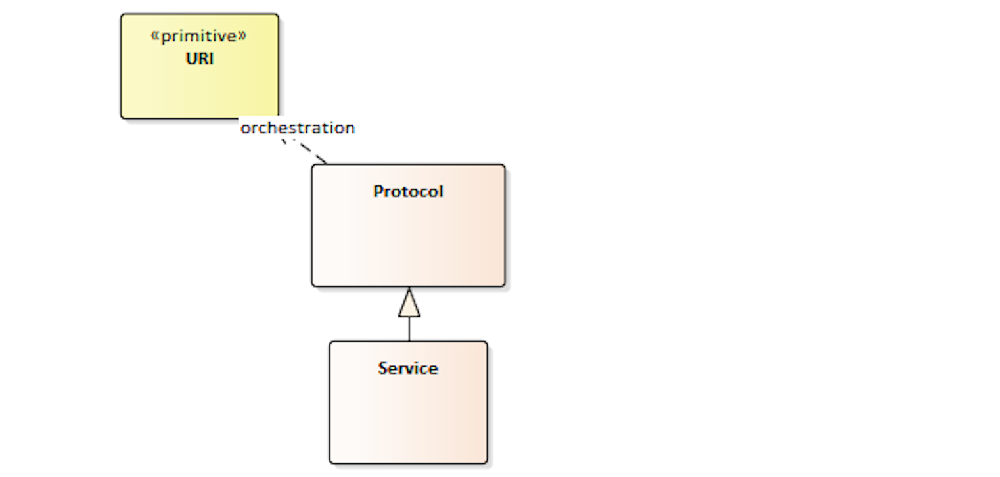

# Introduction


## Objectives

FIX Orchestra was conceived as **machine-readable rules of engagement**
between counterparties. As such, it is a standard for exchange of
metadata about the behavior of message-based, electronic interfaces.
Orchestra is intended to automate the development, testing, and documentation
of programmable interfaces and cut time to onboard counterparties.

The contents of Orchestra files are machine-readable (that is, processed
as data) and may include:

  - Message structure by each scenario, implemented as an extension of the FIX Repository.

  - Accepted values of enumerations by message scenario

  - Workflow: when I send this message type under this condition, what
    can I expect back?

  - How external states affect messages, e.g. market phases

  - Express a condition such as for a conditionally required field using
    a Domain Specific Language (DSL)

  - Document and exchange the Algorithmic Trading Definition Language
    (FIXatdl&reg;) files associated with a FIX service offering

  - Session identification and transport configuration

From the contents, firms and vendors will be enabled to develop tools to
automate configuration of interface engines and applications, and generation
of code, test cases, and documentation. The various aspects are not an
all-or-nothing proposition, however. Users may implement only the
features that they find most beneficial and add features as needed.

Orchestra supports but does not change FIX Protocol itself in any way,
nor does it obsolete existing FIX engines or tools.

## Protocol coverage

The features of Orchestra are intended to be generic and capable of
covering both FIX and non-FIX messaging protocols. One of the
foundational features to support non-FIX protocols is the ability to
describe any set of datatypes, not just FIX tag=value datatypes
(see section [Datatypes](#datatypes)).

## Design principles

As a standard for delivering metadata about electronic messages and application
behavior, Orchestra relies on technologies that are well supported
across all popular platforms and programming languages, particularly XML
and XML Schema.

Since Orchestra is primarily used at design time or compile time rather
than run time, high performance characteristics such as low latency are
not a major concern.

In future, Orchestra may be ported to alternative technologies,
particularly Web Ontology Language (OWL). However, the primary XML
technologies will continue to be supported for the foreseeable future.

## Glossary

**Actor** — either a counterparty to a session or an external entity
that holds state relevant to application or session behavior. An actor
can take actions such as assigning state or transitioning a state
machine, and it can send messages.

**Code set** — A finite set of the valid values of a data element. Each
unique valid value is called a code.

**Datatype** – the value space of a data element, possibly including
enumerated values, precision or range. Some types have additional
attributes, e.g. epoch and time zone of a date. Value space is at the
application layer (layer 7 of the OSI model).

**Discriminator** — a field that can modify the value space of another
field. The combination of the value field and its discriminator is
variously called a choice, discriminated union, tagged union, or
variant.

**Encoding** – a wire format for data representation. Also known as
lexical space or the presentation layer (layer 6) in a protocol stack.

**Lexical space** – the representation of a data element. It belongs to
the presentation layer. For character-based encodings, it is defined as
a particular sequence of characters. For binary encodings, it may
involve mapping to primitive data types supported by computing
platforms.

**Pedigree** – recorded history of an artifact.

**Provenance** – a record of ownership of an artifact.

**Release** – incremental extension of a version of an interface application, e.g. a FIX extension Pack (EP).

**Scenario** — a use case of a message, component, field, code set or datatype.

**Semantic** — pertaining to the meaning of a message element, regardless
of its representation.

**Session protocol** – a protocol concerned with the reliable delivery
of messages over a transport. Layer 5 in the OSI protocol model.

**State machine** – A behavior model that has finite, discrete values
called states and defined transitions between states.

**Tag** – a unique numeric identifier of a message element, especially a
field identifier.

**Value space** – the type of a data element and its possible range of
values. Value space belongs to the application layer (semantics) and
should be independent of encoding (presentation layer) and programming
language.

**XML schema** – defines the elements and attributes that may appear in an
XML document. The Orchestra schemas are defined in W3C (XSD) schema
language since it is the most widely adopted format for XML schemas.

## Documentation

### Specification terms

The following key words in this document are to be interpreted as described in
[Internet Engineering Task Force RFC2119](http://www.apps.ietf.org/rfc/rfc2119.html).

- These terms indicate an absolute requirement for implementations of the standard:
"**must**", or "**required**".

- This term indicates an absolute prohibition: "**must not**".

- These terms indicate that a feature is allowed by the standard but not
required: "**may**", "**optional**". An implementation that does not
provide an optional feature must be prepared to interoperate with one
that does.

- These terms give guidance, recommendation or best practices:
"**should**" or "**recommended**". A recommended choice among
alternatives is described as "**preferred**".

- These terms give guidance that a practice is not recommended: "**should
not**" or "**not recommended**".

### Document format

In this document, the following formats are used for technical specifications
and data examples.

XML element names appear in the text as follows: `<field>`. XML attribute names appear in the text as follows: `name`

XML snippets are shown as follows:

```xml
<fixr:field id="59" name="TimeInForce" codeSet="TimeInForceCodeSet"/>
```

## References

### Related FIX Standards

The examples in this document are based on the FIX Protocol.
For FIX semantics, see the FIX online specification, a.k.a.
[FIX Latest](https://www.fixtrading.org/online-specification/).

### Dependencies on other standards

Orchestra imports [Dublin Core XML schemas version 2008-02-11](http://dublincore.org/schemas/xmls/) for artifact
provenance. [Dublin Core](https://www.dublincore.org/specifications/dublin-core/dcmi-terms/) is standardized as IETF RFC 5013 and ISO 15836.

XML 1.1 schema standards are located at [W3C XML Schema](http://www.w3.org/XML/Schema.html#dev)

[XML Inclusions (XInclude) Version 1.1](https://www.w3.org/TR/xinclude-11/)

Incremental changes to an XML file may be represented by the format described in [IETF RFC 5261](https://tools.ietf.org/html/rfc5261).

Textual encoding of security keys must conform to [IETF RFC 7468](https://tools.ietf.org/html/rfc7468).

Documentation content types should be chosen from the registry of media types (formerly known as MIME) maintained by the Internet Assigned Numbers Authority (IANA). See the registry of text media types at [Media Types](https://www.iana.org/assignments/media-types/media-types.xhtml#text). [Markdown](https://tools.ietf.org/html/rfc7763) is recommended for rich text while `text/plain` is the default.

[ISO 8601:2019](https://www.iso.org/standard/70907.html) Data elements and interchange formats -- Information interchange -- Representation of dates and times. Used for representation of dates, times, and time intervals in DSL expressions.

# Metamodel

Orchestra is based on two metamodels. The repository metamodel contains concepts for message structures and workflow while the interfaces metamodel has concepts for service offerings and sessions.

Each of the two metamodels are implemented in their respective XML schemas. Any other representations that may be developed in future, such as semantic ontologies, should be considered implementations of these common metamodels.

The metamodels presented do not strictly conform to the UML Meta-Object Facility architecture (MOF).

## Repository

The repository metamodel is a conceptual view of message structures.


### Message structure abstractions

**Field**–carries a specific business meaning (semantics) as described in FIX specifications or other protocol. A pointer to a field is a **fieldRef**. The data domain of a field is either a datatype or a code set.

**Datatype**–the value space of a class of fields. For example, FIX tag=value encoding has about 20
datatypes.

**Code set**–a set of valid values of a field. They must all be of the
same datatype.

**Component**–a sequence of fields and nested components and/or groups. A
component is designed to be specified once in detail but reused in
multiple message types by reference. A pointer to a component is a **componentRef**.

**Group, or repeating group**–an *array of* components to be sent on the
wire. A pointer to a group is a **groupRef**.

**Message**–a unit of information sent on the wire between
counterparties. A message is composed of components, groups, and fields. A
pointer to a message is a **messageRef**.

### General Purpose Datatypes

Pointer and array abstractions are defined by the standard ISO 11404. The
code set abstraction is described in that standard as "state" type.

## Interfaces

The interface metamodel is an abstraction of
session provisioning and service offerings. This UML model depicts the main classes.




### Interface abstractions

**Protocol**—a standard for communications. The Open Systems
Interconnection model (OSI) defines protocols as a layered stack,
including application layer and user interface at the top, presentation
layer (encoding), session layer, and transport layer. Each protocol
depends on lower layers for services. Layers below transport layer are
out of scope for Orchestra.

Any message-oriented protocol may have an orchestration attribute that
consists of a URI. It is a link to an Orchestra file that describes
message structures and workflow.

**Service**—a service offering by a counterparty. A service is an
application layer protocol.

**Interface**—a collection of protocols and services exposed by a
counterparty. A counterparty may offer more than one interface for
different purposes. An interface may be configured for one or more
service offerings and all the protocols that make up a communication
stack. Also, an interface may contain any number of session
configurations.

**Session**—a specific usage of an interface. A session has one or more
identifiers. It inherits services and protocols from its parent
interface, but it may have further refinement or overrides of protocol
settings, such as a transport address.

# Orchestra Repository XML Schema

## Repository XML Schema (XSD)

The Repository XML schema is used to control the format of XML files that
describe message structures. Additionally, it contains elements and attributes
for work flow, state variables, conditional logic and more.

### Conformance

All published Orchestra repository files **must** conform to the
standard repository XML schema. This can be validated with common XML parsers and
related tools.

### Schema location

The XML schema is available via the web at the URL https://fixprotocol.io/2023/orchestra/repository/, which is consistent with its XML namespace.

### Root element

The root element of an Orchestra repository XML file is `<repository>`. An Orchestra
repository file contains all the message structures and workflow
elements pertaining to a single protocol version. If an organization
supports multiple versions of a protocol, it should supply an Orchestra file
for each.

The `name` attribute of `<repository>` identifies an implementation of a
protocol. The name should remain stable over minor revisions. The
`version` attribute should, on the other hand, be unique for any
substantive change to the protocol.

This snippet shows that element with required namespaces and attributes:

```xml
<fixr:repository name="FIX.Latest" version="FIX.Latest_EP284"
xmlns="http://purl.org/dc/elements/1.1/"
xmlns:fixr="http://fixprotocol.io/2023/orchestra/repository"
xmlns:dc="http://purl.org/dc/terms/"
xmlns:xsi="http://www.w3.org/2001/XMLSchema-instance"
xmlns:xi="http://www.w3.org/2001/XInclude"
xsi:schemaLocation="https://fixprotocol.io/2023/orchestra/repository repository.xsd">
```

#### Repository attributes

Attributes of the whole repository are set on the root element. The `name`
and `version` attributes are required. Name should be stable even when
minor changes are made to an Orchestra file while version should be
updated for incremental changes.

The following repository attributes are optionally available:

- `applVerId` contains the application version
- `specURL` points to an online reference documentation
- `guid` is a globally unique identifier for the given schema file
- `namespace` contains an associated namespace as URI

By default, the language for conditional expressions is the Score DSL
(See section [Score DSL](#score-dsl)). However, this may be overridden by setting a value
to the attribute `expressionLanguage`.

### Support for XInclude

Many of the elements in the schema (actors, concepts, sections, categories, messages, groups, components, fields, code sets, datatypes, scenarios) support XML Inclusions (XInclude). This allows assembly of an Orchestra XML infoset from multiple, reusable XML files. For example, several service offerings may share datatypes, fields, and even common message types.

For example, `<fixr:datatypes>` element can be replaced with the path to the XML file, e.g. `<xi:include href="src/test/resources/datatypes.xml"/>`. The datatypes then need to be defined in a separate file `datatypes.xml` that needs to contain the same namespace as the root element of the repository, i.e. `<fixr:datatypes xmlns:fixr="http://fixprotocol.io/2023/orchestra/repository">`.

### Supplementary documentation

See the separate document "repository.html" in [GitHub](https://github.com/FIXTradingCommunity/fix-orchestra-spec/tree/master/v1-1/informative) for a detailed technical reference for the Repository XML schema. The remainder of this section serves as an overview and explains motivations for the design.

### Protocol relationship

The schema was primarily designed to describe metadata about the FIX Protocol. However, it is generic enough to work with other common financial industry protocols, especially when FIX is used in combination with other protocols, or a translation must be performed between protocols.

Usage should be supported for all phases of financial industry workflows, including pre-trade, trade, and post-trade flows.

## Content ownership and history

### Provenance

The `<metadata>` element is used to identify a particular Orchestra file
and the issuer of that file. It can contain any of the elements defined
by the Dublin Core XML schema. Recommended elements include title,
publisher, date issued, and rights.

Table: Dublin Core Terms for Orchestra

------------------------------------------------------------------------------------------------------------
DCMI Term               Definition                            Recommended Usage
----------------------- ------------------------------------- ----------------------------------------------
title                   A name given to the resource.         Use for display or in generated documentation.

creator                 An entity responsible for making      Name of the firm or person that created the
                        the resource.                         Orchestra file.

created                 Date of creation of the resource.     Date and time of creation of the Orchestra file.

contributor             An entity responsible for making      Application supporting the creation of the
                        contributions to the resource.        Orchestra file.

publisher               An entity responsible for making      Distributor of the Orchestra file (may be
                        the resource available.               different than the creator).

issued                  Date of formal issuance of the        Reference date for the publication.
                        resource.

rights                  Information about rights held         Copyright notice.
                        in and over the resource.

license                 A legal document giving official      URL to a license or IP statement.
                        permission to do something with
                        the resource.

conformsTo              An established standard to which      Version of the Orchestra Technical Standard
                        the described resource conforms.      that was used to create the Orchestra file.

format                  The file format, physical medium,     Internet Media Type (formerly known as MIME type)
                        or dimensions of the resource.        "application/xml".

isRequiredBy            A related resource that requires      Used to denote downstream service dependencies
                        the described resource to support     (e.g. FIXimate).
                        its function, delivery, or coherence.
------------------------------------------------------------------------------------------------------------

**Example:** FIX Latest Metadata

```xml
<fixr:metadata>
  <dcterms:title>FIX.Latest_EP276</dcterms:title>
  <dcterms:created>2022-12-21T16:27:25.164791</dcterms:created>
  <dcterms:issued>2022-12-22T10:59:14Z</dcterms:date>
  <dcterms:rights>Copyright (c) FIX Protocol Ltd. All Rights Reserved.</dcterms:rights>
  <dcterms:conformsTo>Orchestra v1.0</dcterms:conformsTo>
</fixr:metadata>
```

### Pedigree

Most message elements in the schema support a complete history of creation, latest change, replacement, and potentially deprecation with support of attribute group `entityAttribGrp`. Each historical event should be qualified by its protocol version and may be qualified by its release. This is an integer value, e.g. a FIX extension pack (EP) number that can be used to increase the granularity of the version string, e.g. to identify patches. The latest change may be qualified with the `changeType` attribute as being definitional or only editorial (e.g. adding or updating a `documentation` element of an annotation).

**Example:** A field that was added and then updated to correct an error in the description

```xml
<fixr:field
  type="String" id="17" name="ExecID" abbrName="ExecID"
  added="FIX.2.7" updated="FIX.5.0SP1" updatedEP="95" changeType="Editorial">
</fixr:field>
```

Deprecated elements are not removed from the repository. They may still be used based upon bilateral agreement. However, the publisher of the Orchestra XML file recommends to avoid its usage and should use the `replacedByField` attribute in case of a 1:1 change. The `<annotation>` element may additionally be used to describe the alternate element(s) and new approach.

**Example:** Code element that was deprecated

```xml
<fixr:code
  value="3" name="LocalCommission"
  added="FIX.4.0" deprecated="FIX.5.0SP2" deprecatedEP="204">
</fixr:code>
```

### Naming rules
Since Orchestra supports both FIX and non-FIX protocols, naming rules are relaxed in the XML schema. FIX and other style rules should be enforced by other means, such as a validator application. The only restriction is that names are of XML schema datatype "token", which trims leading and trailing spaces and disallows some non-printable characters like line feeds and carriage returns. Tokens are limited to 64 characters.

## Features for document and schema generation

The XML schema retains features that have long been used to generate FIX
documentation and other outputs. These elements are optional.

### Categories

The `<categories>` element tree is used to associate FIX elements to
business areas, such as single general order handling, market data, and so
forth, for documentation generation. Also, categories are used to
organize FIXML schema files.

### Sections

The `<sections>` element tree names higher level business processes. Typically, a section contains multiple categories. Traditionally,
they have been organized around pre-trade, trade, and post-trade information flows.

### Metadata about any element

The schema provides features to provide metadata about almost any element. All such metadata appears under element `<annotation>`. There is no limit to the number of metadata entries per `<annotation>` element.

Introductory documentation can be provided to the element trees `<categories>`, `<sections>`, `<messages>`, `<groups>`, `<components>`, `<fields>`, `<codeSets>`, `<datatypes>`, `<scenarios>` to describe their child elements in their entirety.

#### Documentation

A `<documentation>` element can carry any description of its ancestor
element. The content (text node) may be of any format, such as XHTML,
markdown, or HTML5. The XML parser is instructed not to validate the
free-form content. Tools such as XSLT may be used to extract
documentation from an Orchestra file and compile external documents.

Multiple languages can be supported by specifying the language of each
element in its `langId` attribute. Also, multiple categories of
documentation are supported by populating the `purpose` attribute.
Suggested values of purpose include "SYNOPSIS", "ELABORATION",
"EXAMPLE", and "DISPLAY".

**Example:** Field element with documentation.

```xml
<fixr:field id="45" name="RefSeqNum">
	<fixr:annotation>
		<fixr:documentation langId="en-us" purpose="SYNOPSIS">
		Reference message sequence number
		</fixr:documentation>
	</fixr:annotation>
</fixr:field>
```
\
Optionally, a `<documentation>` element may be qualified by media type to
support rich text. The default value of attribute `contentType` is
"text/plain". If a rich text encoding is embedded in the XML document,
appropriate XML namespaces may be required.

Documentation elements may set the media type in the `contentType` attribute to any text encoding registered with IANA.

**Example:** Documentation as markdown.

```xml
	<fixr:annotation>
		<fixr:documentation purpose="SYNOPSIS" contentType="text/markdown">
**Account mnemonic** as agreed between buy and sell sides, e.g. broker and institution or investor/intermediary and fund manager.
		</fixr:documentation>
	</fixr:annotation>
```

#### Appinfo

The `<appinfo>` element is similar to `<documentation>` in that it can
support multiple languages and multiple purposes. It has an additional
attribute, `specURL`, to cross-reference external documentation.

### Rendering hints

The optional attribute `rendering` may be used to suggest how a message or
element should be generated or rendered in a user interface. The value
of the attribute is free-form and is not validated by the Orchestra
schema.

### Sort order of codes

The optional attributes `group` and `sort` may be used to suggest how the codes in a code set should be displayed in a user interface. When both attributes are used, the codes will initially be sorted by the `group` attribute and the value of the `sort` attribute is relative to the group. The value of the `group` attribute is free-form. The value of the `sort` attribute is validated by the Orchestra schema and must be a non-negative integer.

## Unique identifiers

Practically all elements in the XML schema have a `name` attribute, a
numeric `id` attribute or both. These values must be unique within their
respective element types within a given Orchestra file. To avoid
collisions, names and IDs of deprecated elements should never be reused.

## Scenarios

A scenario may be used to distinguish multiple use cases of a single message, group, component, field, code set or datatype. The respective element may be referenced more than once in the XML schema by adding `scenario` and/or `scenarioId` attributes in addition to the `id` and/or `name` attributes of the element. Scenarios in the context of the different elements are explained in more detail within the respective sections below.

Each scenario is described by a `<scenario>` element, a child of `<scenarios>`.

## Datatypes

A datatype is a context-free value space. That is, a domain of possible
values relatively free of business semantics. For a specific message
encoding protocol (presentation layer), a datatype is mapped to the
syntax of that encoding, also known as lexical space.

Some fields are specified as a set of valid values. This is known as
*code set*, and it can be thought of as a specialized datatype (see the [Code sets](#code-sets) section below).

Each datatype is described by a `<datatype>` element, a child of `<datatypes>`.

### FIX datatypes

The term "FIX datatype" is used to refer to a datatype in the context of the FIX tag=value encoding. FIX supports a number of encodings such as FIXML, SBE, GPB, and JSON. FIX fields are categorized into roughly 20 FIX datatypes. A datatype should be defined in terms of its value space, the range of its possible values, not in terms of its lexical space, its encoding format. In fact, a FIX datatype may be mapped to any number of wire formats (see the [datatype mappings](#datatype-mappings) section below).

A datatype may optionally inherit properties from a type specified by
the `baseType` attribute. For example, FIX datatype "Qty", used by fields like
OrderQty(38), has `baseType` of float, a more generic FIX datatype.

Generally, FIX datatypes for FIX protocols need to be defined only once and
are copied from the baseline standard. However, the datatypes section
may contain different definitions for non-FIX protocols.

### Datatype scenarios

Datatype definitions may optionally create different subsets of permitted values by means of the `scenario` and `scenarioId` attributes. In addition to the base datatype, for example integer, one may define different scenarios for 8-, 16-, 32-, or 64-bit and signed or unsigned integers. The `baseType` attribute is not needed when using datatype scenarios and may be deprecated in a future version of Orchestra.

**Example:** An integer datatype with an additional scenario for sequence numbers.

```xml
<fixr:datatype name="int" scenario="base">
	<fixr:mappedDatatype standard="XML" base="xs:integer"/>
	<fixr:mappedDatatype standard="ISO11404" base="Integer"/>
</fixr:datatype>

<fixr:datatype name="int" scenario="SeqNum">
	<fixr:mappedDatatype standard="XML" base="xs:positiveInteger"/>
	<fixr:mappedDatatype standard="ISO11404" base="Ordinal"/>
</fixr:datatype>
```

### Datatype mappings

A `<datatype>` element may contain `<mappedDatatype>` elements
corresponding to any number of type systems. Type systems include XML,
SBE, GPB, JSON, and ISO 11404, a generic type taxonomy. An XML schema
mapping is obviously needed by FIXML.

The `standard` attribute of `<mappedDatatype>` tells which type system the
mapping is for. Its `base` attribute tells what the FIX datatype maps to
in the particular standard. For example, FIX datatype "Qty" maps to XML schema
type xs:decimal.

The `<mappedDatatype>` element allows any snippet of well-formed XML to
be pasted in as a child element that is a meaningful specification to an
encoding protocol.

The ISO/IEC 11404 General Purpose Datatypes standard contains a taxonomy
of programming language-independent types and enumerates their
characteristics. One of the benefits of following this standard is that
it will be easier to map FIX datatypes to other message standards, such
as ISO 20022 (SWIFT).

Rather than creating numerous one-off mappings to
other type systems, is it likely more efficient to map each to ISO 11404
once, and then compare mappings in an associative model to identify the
commonalities. (The XML schema standard claims to derive its datatypes
from ISO 11404, but mapping to the generic standard is more precise and
comprehensive than filtering it through the XML interpretation.)

The lower and upper bounds of a bounded datatype may be set with
`minInclusive` and `maxExclusive` attributes. The `size` attribute may be
used to define the field length in the target encoding, e.g. to support
mappings to fixed-length encodings such as SBE.

**Example:** A datatype using a base type with mappings to XML schema and General-Purpose Datatypes.

```xml
<fixr:datatype name="SeqNum" baseType="int">
	<fixr:mappedDatatype standard="XML" base="xs:positiveInteger"/>
	<fixr:mappedDatatype standard="ISO11404" base="Ordinal"/>
</fixr:datatype>
```

**Example:** A datatype scenario with a mapping to SBE.

```xml
<fixr:datatype name="String" scenario="MIC">
	<fixr:mappedDatatype standard="SBE" base="String" size="4"/>
</fixr:datatype>
```

## Code sets

A code set contains a finite collection of valid values of a data
element. Each unique valid value is called a code. In the terminology of
ISO 11404, such a data element is called a "state". (This is
distinguished from an enumeration, in which the order of values matters.
In a state, each of the values must be unique, but order is not
significant. Hence, the values collection is a set.)

In FIX and other protocols, many fields may share a code set. For
example, the SecurityIDSource(22) and UnderlyingSecurityIDSource(305) fields
share the same valid values, or code set.

A code set has an underlying datatype to tell its domain of possible
values. Codes may legally be of any type listed in the `<datatypes>`
section, but typically are int, char or String datatypes in FIX. In an
Orchestra file, a code value is presented as a string, but it should be
actually transmitted in the correct encoding for the datatype of the
code set. For example, if the datatype of a code set was "int", value
"27" should be transmitted in a binary wire format for integer 27, not
as character "2" and then character "7".

A `<codeSets>` element contains any number of `<codeSet>` child
elements. The schema allows zero or more instances of `<codeSet>`
elements, each with a unique `name` attribute.

The names of code sets and datatypes share a common namespace and must
be unique within a schema. This constraint is enforced by the XML
schema.

### Internal code sets

Internal code sets are maintained in a Repository or Orchestra file by
the issuer. The `<code>` elements that belong to the code set are listed
explicitly.

#### Codes

An internal `<codeSet>` is a container for `<code>` elements. In the
schema, each code has a `name` attribute to tell its logical name, and a
`value` attribute to tell its value on the wire. Additionally, each
`<code>` element has a numeric `id` attribute.

Codes may be added to a code set over time, or existing codes may be
deprecated. The history of codes within a code set may be recorded using
the pedigree attributes of attribute group `entityAttribGrp`.

Codes may be documented with an `<annotation>` element tree.

**Example:** An internal code set.

```xml
<fixr:codeSet type="char" id="165" name="SettlInstSourceCodeSet">
	<fixr:code value="1" added="FIX.4.1" id="165001" name="BrokerCredit"/>
	<fixr:code value="2" added="FIX.4.1" id="165002" name="Institution"/>
	<fixr:code value="3" added="FIX.4.3" id="165003" name="Investor"/>
</fixr:codeSet>
```

#### Code set scenarios

Code sets may have different supported codes in different scenarios. For
example, outbound FIX ExecutionReport(35=8) messages may have a more enriched view
of PartyRole(452) than is required on inbound order messages. Therefore, a
`<codeSet>` may be qualified by its `scenario` and/or `scenarioId` attribute. The default
values of `scenario` and `scenarioId` are "base" and 1, respectively, so the attributes need not be supplied if
there is only one form of a code set.

Uniqueness of code set scenarios is enforced by the XML schema, both as
the combination of `name` + `scenario` as well as `id` + `scenarioId`.

#### Code name validation

Since Orchestra supports both FIX and non-FIX protocols, rules for the validation of code names are relaxed in the XML schema. Style rules should be enforced by other means, such as a validator application.

#### Union datatypes for code sets {#union-datatype}

Code sets may have a second datatype to extend the list of values defined as codes with the underlying datatype given by the `type` attribute. Orchestra supports this by means of the `unionDataType` attribute of the `<codeSet>` element. The underlying datatype of a code set may be combined with the following union datatypes defined in the XML schema that also need to be defined as separate `<datatype>` elements in the XML file.

- Reserved100Plus: integer values of 100 and above,
- Reserved1000Plus: integer values of 1000 and above
- Reserved4000Plus: integer values of 4000 and above
- Qty: decimal values, supporting unions of strings and explicit numeric values
- Tenor: string values, supporting unions of explicit code sets with flexible patterns

FIX uses the ReservedXXXPlus datatypes to support a range of user-defined values as a union with standard FIX values that have a reserved range below a certain threshold. The Qty datatype is used by FIX for backward compatibility to combine the legacy approach for IOI quantities (e.g. "S" for a small quantity) with explicit numeric values. FIX uses the Tenor datatype to express standard settlement types (e.g. 2=Next Day) together with FX standard tenors (e.g. "Dx" for x number of days).

### External code sets

In some cases, code sets are shared with other protocols. Examples include currency, language, and country codes defined by ISO. This is called an external code set because the valid values are maintained by the external standard, not within the Repository or Orchestra file. To provide a reference to an external standard, use `<codeSet>` attribute `specUrl`. Additional references can be supplied with `<annotation>` elements.

In the case of an external code set, `<code>` elements are not listed in the Orchestra file.

**Example:** An external code set ExtCurrencyCode is defined to have the underlying datatype "Currency" with valid values defined by the ISO 4217 standard.

```xml
<fixr:codeSet name="ExtCurrencyCode" type="Currency" specUrl="
http://www.iso.org/iso/home/store/catalogue_tc/catalogue_detail.htm?csnumber=64758">
```

## Fields

A field carries a specific business meaning (semantic) as described in
FIX specifications or another protocol. In the schema, a `<field>` element
is contained by parent element `<fields>`. The collection of fields
should be thought of as an append-only list; the id of a deprecated
field must not be reused. The pedigree attributes of attribute group
`entityAttribGrp` are used to tell the history of a field, including the
protocol version in which it was added.

In Orchestra, a field has two unique identifiers, numeric id, also known as
"tag" in the context of FIX, and a descriptive string name.

Like other message elements, a field may be documented with an
`<annotation>` element tree as described above. Also, the `baseCategory`
attribute may be used to categorize fields. There are several more
optional attributes which are described in the message structure section
below.

### Field scenarios

Fields may have different scenarios when any of the attributes need to differ, for example to vary annotations or to use different code set scenarios for different use cases. Scenarios also support different field lengths when using the `implLength` attribute. The default
values of `scenario` and `scenarioId` are "base" and 1, respectively, so the attribute need not be supplied if there is only one form of a field.

Uniqueness of field scenarios is enforced by the XML schema, both as the
combination of `name` + `scenario` as well as `id` + `scenarioId`.

### Data domain of a field

Every field must have a data domain of either a datatype name or more specifically, a collection of valid values specified by a code set reference. The domain of a field is specified in its `type` attribute in case of a datatype and in its `codeSet` attribute in case of a code set. The attribute `type` refers to a `<datatype>` element and the `codeSet` attribute refers to a `<codeSet>` element by the respective `name` attribute. In the case of a `<codeSet>`, there is a level of indirection to its `codeSet` attribute to arrive at a `<datatype>`.

Since `<codeSet>` is also qualified by scenario, a field will link to
the code set of the same scenario. By default, "base" scenario field
links to "base" code set.

**Example:** A field with a code set and another with a datatype domain.

```xml
<fixr:field id="59" name="TimeInForce" codeSet="TimeInForceCodeSet"/>
<fixr:field id="60" name="TransactTime" type="UTCTimestamp"/>
```

#### Union datatypes for fields

Fields may have a second datatype to extend the values supported by the `type` or `codeSet` attribute. Orchestra supports this by means of the `unionDataType` attribute of the `<field>` element. The available union datatypes are defined by Orchestra, see [Union datatypes for code sets](#union-datatype) for details. It is recommended to use the `unionDataType` attribute of the `<codeSet>` element rather than the one of the `<field>` element. The latter is available for backward compatibility.

### Data fields

A field of datatype "data" is variable length. In FIX tag=value encoding,
the length of such a field is prefixed by a separate field of type
Length. In other encodings, the length is implicit in the presentation
protocol. Where needed explicitly for data fields, the associated length field is referenced by the
`lengthId` attribute, a reference to its `id` attribute.

**Example:** A data field and its corresponding length field.

```xml
<fixr:field id="95" name="RawDataLength" type="Length"/>
<fixr:field id="96" name="RawData" type="data" lengthId="95"/>
```

### Encoded fields

A field may have an encoded version represented by two other fields. A `nonEncodedFieldId` attribute is used to link the encoded version of a field to the non-encoded version. Additionally, a `lengthId` attribute is used for encoded fields to link it to the field that contains the length of the encoded field.

**Example:** A data field and its corresponding length field.

```xml
<fixr:field id="106" name="Issuer" type="Length"/>
<fixr:field name="EncodedIssuer" id="349" type="data" lengthId="348" nonEncodedFieldId="106">
<fixr:field name="EncodedIssuerLen" id="348" type="Length">
```

### Discriminator fields

FIX contains fields for which its value domain is modified by another
field. This is variously called a choice, discriminated union, tagged
union, or variant. The field that modifies the range of values of
another field is called a discriminator. For example, SecurityIDSource
is the discriminator for the values of SecurityID. If the value of
SecurityIDSource is 4, then the value of SecurityID must be a valid
ISIN, and so forth. This relationship may be indicated in Orchestra by
adding the attribute `discriminatorId` to a field.

**Example:** A field modified by a discriminator.

```xml
<fixr:field id="48" name="SecurityID" type="String"
abbrName="ID" discriminatorId="22">
	<fixr:annotation>
		<fixr:documentation purpose="SYNOPSIS">
       Security identifier value of SecurityIDSource (22) type (e.g. CUSIP, SEDOL,
       ISIN, etc). Requires SecurityIDSource.
		</fixr:documentation>
	</fixr:annotation>
</fixr:field>
```

### Overridable and fixed field attributes

Some attributes of a field, such as minimum and maximum values and
length, may be overridden for a particular usage in the message
structure that contains a field reference. However, the key identifiers
id and name as well as type attribute may not be overridden. It is
possible to override which codes of a code set are supported in a
particular scenario, however. See section [Message structures](#message-structures) below.

### Field value uniqueness

Some fields are required to be populated with unique values, either
globally or within a defined scope. A scope of uniqueness may be
specified with reference to other fields.

Uniqueness may be specified with the `<unique>` element within a rule
applied to either a field definition or a reference. The uniqueness of a
field may be specified for all uses of the field if a rule is placed as
a child of a `<field>` element, or it may apply to one use case of the
field by placing it within a `<fieldRef>` element.

A globally unique value is required for all instances of a field.

**Example:** Globally unique values.

```xml
<fixr:field id="11" name="ClOrdID" presence="required">  
  <fixr:rule>  
    <fixr:unique/>  
  </fixr:rule>
</fixr:field>
```
\
A key field provides the scope of uniqueness.

**Example:** Unique values per day

```xml
<fixr:fieldRef id="11" name="ClOrdID" presence="required">  
  <fixr:rule>  
    <fixr:unique>  
      <fixr:fieldRef id="75" name="TradeDate"/>  
    </fixr:unique>  
  </fixr:rule>
</fixr:fieldRef>
```
\
A combination of fields defines scope of uniqueness.

**Example:** Unique values per day and market segment.

```xml
<fixr:fieldRef id="11" name="ClOrdID" presence="required">  
  <fixr:rule>  
    <fixr:unique>  
      <fixr:fieldRef id="75" name="TradeDate"/>
      <fixr:fieldRef id="1300" name="MarketSegmentID"/>  
    </fixr:unique>  
  </fixr:rule>
<fixr:fieldRef>
```

## Message structures

### Components

A component is a sequence of fields and nested components or [repeating groups](#repeating-groups).
Individual `<component>` elements are contained by the `<components>` parent element.

Like the messages that contain them, components and groups may be
overloaded for slightly different layouts for different scenarios.

#### Component identifiers

Like a field, a component has a numeric `id` attribute and a
string `name` attribute. The schema enforces uniqueness of the `id` and `name`
attributes among components.

Like a field, a component can be annotated for documentation
and carries pedigree attributes of attribute group `entityAttribGrp`.

The `scenario` and `scenarioId` attributes of a component identify a use case; multiple
components may have the same name, but the combination of name and
scenario must be unique. Scenario name and ID have default values of "base" and 1, respectively, so if a
component only has one variation, there is no need to qualify it.

A component is designed to be specified once in detail but
reused in multiple message types by reference. An example of a FIX component
is "Instrument". It is a collection of the possible fields
describing an instrument, and it is used in many FIX
messages. A component is implemented as a `<component>` element in
the schema.

Rules about the order of fields or nested components, if any, depend upon
the presentation protocol. Since Orchestra supports multiple encodings,
the order of fields in an Orchestra file is not guaranteed to match the
order on the wire.

**Example:** A component containing field references (names are optional).

```xml
<fixr:component category="Common" id="1006" name="LegBenchmarkCurveData" abbrName="BnchmkCurve">
	<fixr:fieldRef id="676" name="LegBenchmarkCurveCurrency"/>
	<fixr:fieldRef id="677" name="LegBenchmarkCurveName"/>
	<fixr:fieldRef id="678" name="LegBenchmarkCurvePoint"/>
	<fixr:fieldRef id="679" name="LegBenchmarkPrice"/>
	<fixr:fieldRef id="680" name="LegBenchmarkPriceType"/>
	<fixr:annotation>
		<fixr:documentation purpose="SYNOPSIS">
         The LegBenchmarkCurveData is used to convey the benchmark information used for pricing in a multi-legged Fixed Income security.
      </fixr:documentation>
</fixr:component>
```

#### Component members

A component may contain reference elements of three types in any
combination. A component must contain at least one member.

  - A `<fieldRef>` element represents a field in a block or repeating
    group. It is a reference to a `<field>` element within the
    `<fields>` container by its `id` and `scenarioId` attributes.
    A `name` attribute for display purposes may optionally be provided.
    A `baseFieldId` attribute is used to link the referenced field to another
    field reference inside the same component, e.g. to link an encoded version
    of a field to the non-encoded version.
    A `lengthId` attribute is used for encoded fields to link the referenced
    field to the field reference inside the same component that contains the
    length of the encoded field.

  - A `<componentRef>` element represents a nested component. There is
    no limit in the schema to the level of nesting, although a
    presentation protocol may have rules about it, and there may be
    practical limits. The reference must match the referenced
    `<component>` on both `id` and `scenarioId` attributes.
    A `name` attribute for display purposes may optionally be provided.

  - A `<groupRef>` element similarly refers to a nested `<group>`
    element (see [below](#repeating-groups)) by its `id` and `scenarioId` attributes. Limits of
    the size of a particular instance of a repeating group may be
    overridden by setting `implMinOccurs` and `implMaxOccurs` attributes on
    the `<groupRef>` element.
    A `name` attribute for display purposes may optionally be provided.

**Example:** A component with different kinds of members and pedigree information.

```xml
<fixr:component added="FIX.4.3" category="Common" abbrName="Instrmt" id="1003" name="Instrument">
    <fixr:fieldRef id="55" name="Symbol" added="FIX.4.3" updated="FIX.Latest" updatedEP="277">
    <fixr:fieldRef id="48" name="SecurityID" added="FIX.4.3">
    <fixr:fieldRef id="22" name="SecurityIDSource" added="FIX.4.3" updatedEP="161" updated="FIX.5.0SP2">
</fixr:component>
```

### Repeating groups

A repeating group is like a component but with one additional
feature: it represents an *array of* components to be sent on the wire.

A repeating group is specified by a `<group>` element and the `<group>`
elements are contained by the `<groups>` parent element. The `<group>` element
has a child element to specify the associated cardinality field by id,
`<numInGroup>`, and optionally by name. In
FIX tag=value encoding, a cardinality field of FIX datatype NumInGroup precedes the
array when transmitted. In other encodings, such as FIXML, the array is
implicit in the presentation protocol.

Limits on the size of a repeating group may optionally be specified with
`implMinOccurs` and `implMaxOccurs` attributes. If those attributes are not
present, then the repeating group has unbounded size.

**Example:** A repeating group with member fields and a reference to the cardinality field.

```xml
<fixr:group added="FIX.4.3" category="Common" abbrName="Pty" id="1012" name="Parties">
    <fixr:numInGroup id="453" name="NoPartyIDs" added="FIX.4.3"/>
    <fixr:fieldRef id="448" name="PartyID" added="FIX.4.3" updatedEP="204" updated="FIX.5.0SP2"/>
    <fixr:fieldRef id="447" name="PartyIDSource" added="FIX.4.3" updatedEP="204" updated="FIX.5.0SP2"/>
    <fixr:fieldRef id="452" name="PartyRole" added="FIX.4.3" updatedEP="204" updated="FIX.5.0SP2"/>
    <fixr:fieldRef id="2376" name="PartyRoleQualifier" added="FIX.5.0SP2" addedEP="179"/>
    <fixr:groupRef id="2077" name="PtysSubGrp" added="FIX.4.4"/>
</fixr:group>
```

### Member presence

Each of the members of a component, group or message, namely `<fieldRef>`, `<componentRef>` or `<groupRef>`, have a `presence` attribute. The possible values of presence are:

  - **required**—the member MUST always be present in a message.

  - **optional**—the member MAY be present; it may be conditionally
    required based on a rule.

  - **forbidden**—the member MUST NOT be present.

  - **ignored**—the member MAY be present but is not processed by the
    receiving party, and thus, no validation is performed on it.

  - **constant**—the field has a constant value.

The receiver of a message with a forbidden element or lacking a required element may reject it using appropriate actions defined by the rules of engagement.

#### Constant field value

A field may be set to a constant value. A specific value of a field is
often useful to distinguish scenarios or use cases for a message type.
For example, values of ExecType(150) distinguish various scenarios of
ExecutionReport(35=8). Also, if a presentation protocol supports constants, a
constant field need not be transmitted on the wire.

**Example:** A constant field. SecurityIDSource is always code '1' (CUSIP).

```xml
<fixr:fieldRef id="22" name="SecurityIDSource" presence="constant" value="1"/>
```

#### Default value of an optional field

For an optional field, a default value may be specified if the sender
does not provide the field.

**Example:** An optional field with a default value. TimeInForce(59) default is '0' (Day).

```xml
<fixr:fieldRef id="59" name="TimeInForce" presence="optional" value="0"/>
```

#### Conditionally required field

The presence of a conditionally required field depends upon other fields
in a component or message. For example, StopPx(99) is required when OrdType(40)
is 3=Stop or 4=StopLimit. If OrdType(40) has any other value like Limit or
Market, then StopPx(99) is not required.

The condition that tells when a conditionally required field is required
is contained by a `<rule>` element tree under a `<fieldRef>`. A `<rule>`
element may contain an override of `presence` as well as certain other
field attributes. Each rule is specified by a `<when>` element that
gives the condition for the override. The XML content (text node) of the
`<when>` element is a conditional expression that follows a grammar
described in the conditional expressions section below. The attribute
override such as `presence=″required″` attribute is applied to the
`<when>` element.

**Example:** Rules for a conditionally required field. A stop price is only required in the context of a stop order. On the other hand, a stop price must not be present in case of a limit order (or any order type other than a stop order). In this case, the order type or the presence of the stop price may be wrong and it is better to reject the order based on the rule instead of the recipient trying to find out which part is incorrect.

```xml
<fixr:fieldRef id="99" name="StopPx" presence="optional">
	<fixr:rule name="StopOrderRequiresStopPx" presence="required">
		<fixr:when>OrdType == ^Stop</fixr:when>
	</fixr:rule>
	<fixr:rule name="LimitOrderForbidsStopPx" presence="forbidden">
		<fixr:when>OrdType \!= ^Stop</fixr:when>
	</fixr:rule>
</fixr:fieldRef>
```

#### Mutually exclusive component members

Sometimes members of a component or group are intended to be mutually exclusive. This is expressed by adding the attribute `which="oneOf"` to a `<component>` or `<group>` element. In a message that contains the component or group, *one and only one* of its mutually exclusive members must be present.

**Example:** The fields OrderQty(38) and CashOrderQty(152), and the nested component OrderQtyDataCIV are mutually exclusive members the OrderQtyData component.

```xml
<fixr:component id="1011" name="OrderQtyData" abbrName="OrdQty" which="oneOf">
	<fixr:fieldRef id="38" name="OrderQty"/>
	<fixr:fieldRef id="152" name="CashOrderQty"/>
	<fixr:componentRef id="9999" name="OrderQtyDataCIV"/>
	<fixr:annotation>
		<fixr:documentation purpose="SYNOPSIS">
         The OrderQtyData component block contains the fields commonly used for indicating the amount or quantity of an order. Note that when this component block is marked as "required" in a message either one of these three fields must be used to identify the amount: OrderQty, CashOrderQty or OrderPercent (in the case of CIV).
		</fixr:documentation>
	</fixr:annotation>
</fixr:component>

<fixr:component id="9999" name="OrderQtyDataCIV" abbrName="OrdQty">
	<fixr:fieldRef id="516" name="OrderPercent" presence="required"/>
	<fixr:fieldRef id="468" name="RoundingDirection"/>
	<fixr:fieldRef id="469" name="RoundingModulus"/>
</fixr:component>
```

Similarly, the attribute `which="anyOf"` indicates that *at least one* of the members of a component must be present.

To require *all* of the members to be present, set `presence="required"` on each member.

### Message

A message in an Orchestra file describes a unit to be sent on the wire
between counterparties.

Like a `<component>`, a `<message>` element has `id` and `name` attributes.
It also has an `msgType` attribute, a short name defining the message type. In FIX,
`msgType` is used for the value of the FIX field MsgType(35).

Another attribute of `<message>` called `flow` ties a message to an
exchange of messages between actors.

#### Message structure

The `<messages>` element contains any number of child `<message>`
elements. From the perspective of the XML schema, a `<message>` is very
similar to a `<component>`; they contain the same member types and share
most attributes. However, `<message>` is a top-level entity only; it
cannot be contained by other message parts, nor can messages be nested.

Unlike `<component>`, the parts of a message are contained by a an optional child
`<structure>` element, which in turn holds `<fieldRef>`,
`<componentRef>` and `<groupRef>` elements.

**Example:** A message structure with a field, nested components, and a nested repeating group.

```xml
<fixr:message name="TradingSessionList" id="100" msgType="BJ"
category="MarketStructureReferenceData" section="PreTrade">
	<fixr:structure>
		<fixr:componentRef id="1024" name="StandardHeader" presence="required"/>
		<fixr:componentRef id="1057" name="ApplicationSequenceControl"/>
		<fixr:fieldRef id="335" name="TradSesReqID"/>
		<fixr:groupRef id="2099" name="TrdSessLstGrp" presence="required"/>
		<fixr:componentRef id="1025" name="StandardTrailer" presence="required"/>
	</fixr:structure>
</fixr:message>
```

#### Message scenarios

A single message type is often reused for multiple use cases. Each of the variations of a single message type can have a slightly different message structure. For example, a FIX ExecutionReport(35=8) message is overloaded for acceptance, rejection, execution, cancel confirmation of an order. The attributes that name a use case are `scenario` and `scenarioId`. If no scenario name or ID is explicitly given, they default to "base" and 1. The combination of `id`, `scenario`, and `scenarioId` attributes must be unique.

An optional `when` element allows to provide an expression to describe the condition under which a scenario is valid. The contents of `<when>` is a Score DSL expression. It is a predicate (Boolean expression) that tells if the scenario applies, i.e. if the expression evaluates to true. This can be used to determine the scenario for the validation of an incoming message or for the generation of an outgoing message. The expression can reference one or more elements of the message, e.g. specific field and its value(s).

**Example:** A message scenario with a condition.

```xml
<fixr:scenario name="Execution" id="6"/>
...
<fixr:message msgType="8" id="9" name="ExecutionReport" scenarioId="6">
	<fixr:structure>
		<fixr:componentRef presence="required" id="1024" name="StandardHeader"/>
		...
		<fixr:componentRef presence="required" id="1025" name="StandardTrailer"/>
	</fixr:structure>
	<fixr:when>ExecType == ^Trade/>
</fixr:message>
```

#### Message responses

Aside from `<structure>`, `<message>` has another optional child element called `<responses>`. It can be used to define messages that are used to respond to a given message supporting the definition of complete workflows. See section [Workflow](#workflow) for details.

## Expressions

### Conditional expressions

Conditional expressions are rules that are expressed in a Domain Specific
Language (DSL). They are evaluated by substituting actual values from a
message and other state information for tokens in the expression. A
conditional expression is of Boolean type. That is, it evaluates true or
false. If true, it determines the value of another attribute or that
some action should take place, such as sending a certain response
message.

Conditional expressions are used in Orchestra:

  - To tell when a conditionally required field is required
    (presence=required);

  - To tell when a field attribute aside from `presence` is overridden,
    such as setting the range of valid values with `minInclusive` and
    `maxInclusive` attributes. It can even tell when to override the `type`
    of a field. For example, the `type` of SecurityID(48) could be overridden,
    depending on the value of SecurityIDSource(22). Some kinds of SecurityID(48) values are strings while others are numeric;

  - To tell when a specific workflow response should be sent or other
    action taken.

All conditions are declared in the XML content of a `<when>` element.
See section [Score DSL](#score-dsl) for details of the grammar.

### Assignment expressions

Assignment expressions are used to set the value of a field in an
outgoing message or to alter a state variable that belongs to an actor.
The grammar of assignment expressions is also governed by the [Score DSL](#score-dsl).

#### Assigning a field

To assign a field in an outgoing message, an `<assign>` element is
placed within the context of a `<fieldRef>` in the message structure.
The content of the `<assign>` element (text node) contains a Score
expression giving the value to set. The value must evaluate to a
datatype compatible with the type of the field.

**Example:** Echo the value of a field from an incoming message.

```xml
<fixr:fieldRef id="11" name="ClOrdID">
	<fixr:assign>in.ClOrdID</fixr:assign>
</fixr:fieldRef>
```

#### Assigning repeating group entries

Within the context of a `<groupRef>`, one or more `<blockAssignment>`
elements may be used to specify the assignment of fields in entries of a
repeating group. Each instance of `<blockAssignment>` will cause another
entry to be constructed. Within a `<blockAssignment>`, the syntax for
assigning fields is the same as the assignment of an individual field
shown above.

**Example:** Assignment of two entries in the Parties repeating group.

```xml
<fixr:groupRef id="1012" name="Parties">
	<fixr:blockAssignment>
		<fixr:fieldRef id="448" name="PartyID">
			<fixr:assign>"ABC"</fixr:assign>
		</fixr:fieldRef>
		<fixr:fieldRef id="447" name="PartyIDSource">
			<fixr:assign>^GeneralIdentifier</fixr:assign>
		</fixr:fieldRef>
		<fixr:fieldRef id="452" name="PartyRole">
			<fixr:assign>^ExecutingFirm</fixr:assign>
		</fixr:fieldRef>
	</fixr:blockAssignment>
	<fixr:blockAssignment>
		<fixr:fieldRef id="448" name="PartyID">
			<fixr:assign>"DEF"</fixr:assign>
		</fixr:fieldRef>
		<fixr:fieldRef id="447" name="PartyIDSource">
			<fixr:assign>^GeneralIdentifier</fixr:assign>
		</fixr:fieldRef>
		<fixr:fieldRef id="452" name="PartyIDRole">
			<fixr:assign>^ClearingFirm</fixr:assign>
		</fixr:fieldRef>
	</fixr:blockAssignment>
</fixr:groupRef>
```

#### Assigning a state variable

To assign the value of a state variable when an event occurs, use the
`<assign>` element within a response. The expression contained by the
element must refer to a state variable contained by an actor. See
section [Responses](#responses).

### Field attribute rules

Optionally, a `<rule>` element may be added as a child to `<fieldRef>`
to control an attribute of a field dynamically. Multiple rules are
allowed for the same field reference to affect multiple attributes or to
generate different values of an attribute under different conditions.

The attributes of a `<fieldRef>` that can be controlled by a rule
include type and any member of the fieldAttribGrp attribute group. That
group includes the `presence` attribute and attributes to control the length of a field.
A rule about presence tells when a conditionally required field is
required.

### Field validation rules

Orchestra has several ways to specify when a field value is valid. One
is to set a field’s type to a code set that lists all valid values.
Another is to set a valid range using attributes `minInclusive` and
`maxInclusive`.

More complex rules can be written under a `<fieldRef>` that reference
the values of other fields or the state variables of actors. Rules can
be dynamic. For example, a market might reject orders with limit
price outside a band of some differential above or below the last sale
price.

Rule violations can then be captured by a state variable, and if
appropriate, an action can be taken, such as sending a reject message.
It is important, particularly when generating test systems, to capture
all violations rather than reacting to the first one encountered. It is
recommended to capture all violations in a repeating group variable of
an `<actor>` element. Responses can be defined in the actor to perform
actions such as sending a reject message for certain kinds of
violations.

**Example:** A field validation rule sets a state variable when tripped.

```xml
<fixr:fieldRef id="44">
	<fixr:rule name="tick" >
		<fixr:assign>$validator.ViolationGrp[].ruleViolated="tick"</fixr:assign>
    <!-- price not equal to tick increment of .05 -->
	<fixr:when>(Price * 100) % 5 != 0</fixr:when>
	</fixr:rule>
</fixr:fieldRef>
```
\
**Example:** A state variable to hold rule violations.

```xml
<fixr:actor name="validator">
	<fixr:group id="10000" name="ViolationGrp">
		<fixr:numInGroup id="10001"/>
		<fixr:field id="10002" name="ruleViolated" type="String">
	</fixr:group>
</fixr:actor>
```

### Response conditions

A `<when>` element with a conditional expression is also supported in the
`<message>/<responses>` element tree. See section [Workflow](#workflow) for usage.

## Workflow

Workflow is the behavior of a party with respect to the exchange of
messages. For each received message type, one or more possible actions
can be specified under the `<message>/<responses>` element.

Workflow in Orchestra recognizes that there is not always a 1:1
relationship between a message type and a use case. Some message
types, for example the FIX ExecutionReport(35=8) message, are overloaded for many different
use cases. Therefore, messages in Orchestra are identified primarily by
their `msgType` value, but with a qualification for a specific use case. Each message use case is called a scenario.

Behavior may depend upon more information than a received message itself.
External state information enters it as well, e.g. the state of an order
book. The `<actors>` element tree provides a place to store such
external state information. An actor can also be used to identify the
originator or receiver of a message.

### Workflows with message scenarios

A message scenario is one use case of a specific message type, as identified by
key attributes `name` and `msgType` in the `messageAttribGrp` attribute group
supported by `<message>`. A scenario name is stored in the `scenario`
attribute of `<message>`. If there is only one use case for a message
type, then scenario need not be populated. It defaults to "base".
Scenarios must be unique per message type and it is an error to have
more than one `<message>` element of the same type without a scenario
since they would in effect be duplicates of scenario "base".

This standard imposes no naming convention for scenarios. Implementers
are free to choose names that are meaningful in their business.

Each scenario is represented by a `<message>` element, and thus has its
own message contents in its `<structure>` child element and its own
`<responses>` element tree.

#### Mapping a message to a scenario

*This section is non-normative.*

The task of mapping an actual received FIX message to a scenario declaration
in Orchestra is left to implementations. The first level of matching is
on the `msgType` attribute with the FIX MsgType(35) field. However, that message type may have
several scenarios. Pattern matching strategies might include comparing a
message to expected required fields, mapping values of a distinguishing
field like ExecType(150) to its code set literals, and so forth.

### Actors

An `<actor>` element represents either a counterparty to a FIX session
or an external entity that holds state relevant to application and
session behavior. An actor can take actions such as assigning state or
transitioning a state machine. If it represents a session counterparty,
it can send FIX messages. Also, actions can be time dependent. An
Orchestra file may declare any number of actors within the `<actors>`
parent element. The `name` attribute of an `<actor>` element must be
unique within an Orchestra file.

#### State variables

Actors can hold state variables in the form of fields. That is, each
state variable has an id and name for identification and a value of a
datatype. Like any field, valid values can be constrained to a code
set or range. The datatype or code set is declared in the `type` or `codeSet`
attribute of the field.

If a state variable corresponds to a standard FIX field, it can be
declared as a `<fieldRef>` element child of the `<actor>`.
Alternatively, it can be declared in-line as a `<field>` element.
Additionally, state variables can be organized as components or
repeating groups.

A state variable can be tested in a conditional expression or set by an
assignment expression.

**Example:** An actor with state variables for TradingSession(336) and TradeDate(75).

```xml
<fixr:actor name="Market">
	<fixr:fieldRef id="336"/>
	<fixr:fieldRef id="75"/>
</fixr:actor>
```

#### State machines

A state machine has discrete values called states and defined
transitions between states. A state machine is declared in XML as a
`<states>` child element of an `<actor>`. The `<states>` element
contains any number `<state>` children, and one initial state of the
state machine, as `<initial>` element. It is an error to declare more
than one initial state. Some state changes are allowed and others
disallowed; changes can only be made through explicitly declared
transitions. A `<transition>` child of a `<state>` or `<initial>` gives
the name of the new state of the state machine in its `target` attribute.

States and transitions must have unique names within a state machine.

The current state of a state machine can be tested by a conditional
expression and a transition can be invoked by an assignment expression.

**Example:** A state machine for market phases.

```xml
<fixr:states name="Phase">
	<fixr:initial name="Closed">
		<fixr:transition name="Reopening" target="Preopen"/>
	</fixr:initial>
	<fixr:state name="Halted">
		<fixr:transition name="Resumed" target="Preopen"/>
	</fixr:state>
	<fixr:state name="Open">
		<fixr:transition name="Closing" target="Preclose"/>
	</fixr:state>
	<fixr:state name="Preopen">
		<fixr:transition name="Opened" target="Open"/>
	</fixr:state>
	<fixr:state name="Preclose">
		<fixr:transition name="Closed" target="Closed"/>
	</fixr:state>
</fixr:states>
```

#### Timers

Some application layer and session layer behaviors are time dependent. An event can fire when a timer expires to affect other states or send a message.

Like a state machine, a `<timer>` is the child of an `<actor>`, and it has a `name` attribute.

**Example:** A timer declaration
```xml
<fixr:timer name="expirationTimer"/>
```
\
**Example:** A timer operation to start a timer that triggers a transition in a state machine. Other events could cancel the timer.
```xml
<fixr:timerSchedule actor="Market" name="expirationTimer" operation="START">
	<fixr:activity>
		<fixr:trigger stateMachine="OrderState" actor="Market" name="Expired"/>
	</fixr:activity>
</fixr:timerSchedule>
```

### Flows

A `<flow>` element represents a stream of messages from one actor
(source) to another (destination). A flow depends on abstractions of the
session and transport layers, but is an application-layer view of
message exchange behavior. It is intended to be session and transport
protocol independent. Multiple application flows may be multiplexed in a
FIX session.

A `<flow>` is identified by its `name` attribute. It must have a `source`
and a `destination` attribute, and both of those must match the `name` of an
`<actor>` element. The `messageCast` attribute defaults to unicast, but
may be set to multicast.

The optional `reliability` attribute describes the delivery guarantee of
messages on the flow. It takes one of these values:

  - **bestEffort**—no delivery guarantee

  - **idempotent**—deliver at-most once

  - **recoverable**—deliver exactly once

**Example:** Actors and flows.

```xml
<fixr:actors>
	<fixr:actor name="BuySide"/>
	<fixr:actor name="SellSide"/>
	<fixr:flow name="OrderEntry" source="BuySide" destination="SellSide"
messageCast="unicast" reliability="idempotent"/>
	<fixr:flow name="Executions" source="SellSide" destination="BuySide"
messageCast="unicast" reliability="recoverable"/>
	<fixr:flow name="MarketData" source="SellSide" destination="BuySide"
messageCast="multicast" reliability="bestEffort"/>
</fixr:actors>
```

### Responses

Responses to a received message can be of these types:

  - A message is sent in reply to the received message
  - A state variable is changed
  - A state machine transition is invoked
  - A timer is started or canceled

Multiple responses can be specified for a given message scenario as
children of its `<responses>` element.

A `<when>` element supplies a conditional expression that triggers a
response if the condition is true. The expression is in the Score DSL
grammar (see section [Score DSL](#score-dsl)). It is possible to trigger multiple
responses if more than one conditional expression evaluates true. If no
`<when>` element is provided for a `<response>`, then the response is
unconditional.

#### Message response

A `<messageRef>` child of a response represents a reply to the received
message. Its name, `msgType` and `scenario` attributes are the combined key
to a matching `<message>` to send.

An optional `<identifiers>` element contains one or more correlations
between a message and its response message. This information supports
the following relationships between chains of messages, such as between an
order and its executions. Each child `<correlate>` element supplies the
id of a field that is common to a message and its response. By default,
a common identifier is assumed to be in the same field in the message
and its response. If it is in different fields, then the `id` attribute
applies to the response message and sourceId applies to original
message. Also, it is possible to assign new identifiers in the response
message. The element `<assign>` is used to describe that case.

**Example:** Send a response message and show correlated and new identifiers.

```xml
<fixr:response name="orderAck">
	<fixr:messageRef
    name="ExecutionReport" msgType="8" implMaxOccurs="1" id="9" implMinOccurs="1">
		<fixr:identifiers>
			<fixr:correlate id="11"/>
			<fixr:correlate id="2422"/>
			<fixr:assign id="37"/>
			<fixr:annotation>
				<fixr:documentation>
				      ExecutionReport(35=8) echoes ClOrdId(11) and OrderRequestID(2422)
              from order message and assigns OrderID(37).
				</fixr:documentation>
			</fixr:annotation>
		</fixr:identifiers>
	</fixr:messageRef>
	<fixr:when>$Market.SecMassStatGrp[SecurityID==in.SecurityID].SecurityTradingStatus !=
             ^TradingHalt and $Market.Phase == "Open"
  </fixr:when>
</fixr:response>
```

#### State variable response

An `<assign>` element changes the value of a state variable belonging to
an actor. Its child element `<assign>` references one or more state
variables to change in the form of an assignment expression.

**Example:** Assign a state variable belonging to actor "participant".

```xml
<fixr:assign>$participant.RiskLimitAmount=15000</fixr:assign>
```

#### State machine response

A `<trigger>` element represents a state machine transition, invoked
when a message is received. Its statemachine attribute identifies the
name of the state machine, and its `name` attribute refers to the name of a
`<transition>` within that state machine.

**Example:** Invoking a state machine transition: the market resumes after a halt.

```xml
<fixr:transitionRef actor="Market" stateMachine="Phase" name="Resumed"/>
```

#### Timer operation response

A `<timerSchedule>` element invokes an operation to either start or
cancel a timer. The `name` attribute refers to the name of the timer,
the operation tells whether to start or cancel, and interval gives the
elapsed time. Interval is expressed in the lexical space of XML schema
type duration. That type includes the magnitude and time unit of the
period in conformance to standard [ISO 8601:2019](https://www.iso.org/standard/70907.html). The `<responses>` elements
represents actions to take when the timer expires. Actions can include
sending a message, setting a state variable, or invoking a state machine
transition.

**Example:** Start a timer for 120 seconds. On timer expiration, send a cancel message, provided the order is still open.

```xml
<fixr:timerSchedule actor="trader" name="exposureTimer"
operation="START" interval="PT120S">
	<fixr:responses>
		<fixr:response>
			<fixr:messageRef name="OrderCancelRequest" msgType="F">
		</fixr:response>
	<fixr:responses>
</fixr:timerSchedule>
```

## Semantic Concepts

Optionally, semantic concepts may be identified by name, even when the
representation of such a concept changes across versions of a protocol.
Anchoring a changing representation to a stable concept can be used to inform
applications such as message translators.

A concept may be tied to a field or group of fields. Values may be variable
or constant. Also, a concept name may be used to link a generic event to
its message type and scenario.

Recognized concept names will be published by the FIX Trading Community. To
maximize portability, users should conform to those names.

**Example:** The semantic concept is stable, but the FIX 4.2 fields were replaced.

FIX 4.2 encoding

```xml
<fixr:concept name="ProgramOrder">
	<fixr:fieldRef id="47" presence="constant" value="D"/>
</fixr:concept>
```
\
FIX 4.4 encoding

```xml
<fixr:concept name="ProgramOrder">
	<fixr:fieldRef id="528" presence="constant" value="P"/>
	<fixr:fieldRef id="529" presence="constant" value="1"/>
</fixr:concept>
```
\
**Example:** The name of a message changed.

FIX 4.2 encoding

```xml
<fixr:concept name="BaseOrder">
	<fixr:messageRef id="14" name="OrderSingle" msgType="D"/>
</fixr:concept>
```
\
FIX 4.4 encoding

```xml
<fixr:concept name="BaseOrder">
	<fixr:messageRef id="14" name="NewOrderSingle" msgType="D"/>
</fixr:concept>
```

# Interfaces XML Schema

## XML Schema (XSD)

The FIXInterfaces schema represents service offering and session
provisioning. Its XML namespace is "https://fixprotocol.io/2023/orchestra/interfaces".

### Conformance

All published Interface files **must** conform to the standard XML
schema. This can be validated with common XML parsers and related tools.

### Schema location

The XML schema is available via the web at the URL https://fixprotocol.io/2023/orchestra/interfaces/, which is consistent with its XML namespace.

### Root element

The root element of an Orchestra interfaces XML file is `<interfaces>`. This snippet
shows that element with required namespaces:

```xml
<fixi:interfaces xmlns:dcterms="http://purl.org/dc/terms/"
xmlns:fixi="http://fixprotocol.io/2023/orchestra/interfaces"
xmlns:xsi="http://www.w3.org/2001/XMLSchema-instance"
xmlns:xi="http://www.w3.org/2001/XInclude"
xsi:schemaLocation="https://fixprotocol.io/2023/orchestra/interfaces interfaces.xsd">
```

### Supplementary documentation

See the separate document "interfaces.html" in [GitHub](https://github.com/FIXTradingCommunity/fix-orchestra-spec/tree/master/v1-1/informative) for a detailed technical reference for the Interfaces XML schema. The remainder of this section serves as an overview and explains motivations for the design.

### Protocol relationship

The schema was primarily designed to describe metadata about FIX
protocols. However, it was also intended to be generic enough to work
with other common financial industry protocols, especially when FIX is
used in combination with other protocols.

### Extensibility

This schema was designed to maximize extensibility so that it represents
a wide range of applications, even with non-FIX protocols. Most elements
allow the addition of attributes and types allow additional child elements,
possibly conformant to other XML schemas.

### Provenance

The `<metadata>` element is used to identify a particular Interfaces
file and the issuer of that file. It can contain any of the elements
defined by the Dublin Core XML schema. Recommended elements include
publisher, date, and rights.

### Session effective times

Optionally, a session may be configured for start and end time. Adding a
session prior to its effective time allows configuration tasks to be
carried out in advance of usage.

### Incremental changes

The Interface file format represents current state. Aside from session
effective times, it does not carry full pedigree. However, if a party
wishes to represent incremental changes to a file, it may do so using
XML patch operations as specified in IETF RFC 5261.

### Interface

The root element `<interfaces>` contains one or more `<interface>`
elements. An interface is a collection of protocols and services exposed
by a counterparty. An interface may be configured for one or more
service offerings and all the protocols that make up a communication
stack. A service offering is exposed as a `<service>` element, and
protocols are given as elements for each layer of a stack. Also, an
interface may contain any number of session configurations under its
child `<sessions>` element. An `<interface>` element has a `name`
attribute.

### Protocols

An `<interface>` element has children for each layer of a protocol
stack. The children are `<userInterface>`, `<encoding>`,
`<sessionProtocol>`, `<transport>`, and `<protocol>`. An `<interface>`
may have multiple instances of a protocol. For example, a session may
use primary and secondary transports.

Each of these child elements may have effective dates and times (`activationTime`, `deactivationTime`) for auditing, analysis and other purposes. It allows to correlate an interface version to a message that was captured on a certain date. The attribute `deprecated` may be used to inform users that a service offering may be removed or replaced in the future.

Any message-oriented protocol may have an `orchestration` attribute that
consists of a URI. It is a link to an Orchestra file that describes
message structures and workflow. A URI may link to a web resource or a
local file.

All the protocol elements have `name` and `version` attributes.

### Service

A service is an application layer protocol. The `<service>` element is of XML protocolType, carrying the same attributes as other protocols and including effective dates and times and a deprecation indicator.

### Transport

The `<transport>` element is derived from XML protocolType but has
additional attributes address, messageCast and use. The optional
`messageCast` attribute has an enumeration of values: unicast, multicast
and broadcast. The optional `use` attribute can have values primary,
secondary and alternate.

### Session

A `<session>` inherits services and protocols from its parent
`<interface>`, but it may have further refinement or overrides of
protocol settings, such as a transport address.

A session has one or more identifiers in child `<identifier>` elements.
The `<value>` child of `<identifier>` may be of any XML type, even an
element tree.

#### Security keys

Security keys may be conveyed for a session in its child `<securityKeys>` element. The content of that element must conform to textual encoding as specified by IETF RFC 7468.

# Score DSL

## Grammar

### Comments

Comments may be inserted in Score expressions in two forms. Comments are
ignored by an expression evaluator but give a humanly readable
explanation.

#### C-language style comments

C-language style comments are contained by tokens /\* and \*/.

**Example:** /\* This is a C style comment. \*/

#### Line comments

Line comments extend from the token // to the next line break.

**Example:** // This is a line comment.

### Literals

A literal stands for a value that is assignable to a FIX datatype.

#### Character literal

A character literal is of FIX datatype char. It is delimited by single
quotes.

**Example:** ′a′

#### String literal

A character literal is of FIX datatype String. It is delimited by double
quotes.

**Example:** "A String literal"

#### Integer literal

An integer literal is of FIX datatype int. It is a sequence of digits and may be preceded by a hyphen character that represents
the unary minus operator.

**Examples:** 123, -123

#### Decimal literal

A decimal literal is assignable to FIX datatypes float, Price, Amt, Qty,
PriceOffset or Percentage. It is a sequence of digits followed by a
decimal point (period character) and another sequence of digits. At
least one digit must precede and follow the decimal point. A decimal
literal may be preceded by a unary minus operator (hyphen character).

**Example:** 123.456

#### Date-time literals

Date, time of day, and date-time literals are delimited by the \#
character. The syntax within the delimiters is governed by the standard
[ISO 8601:2019](https://www.iso.org/standard/70907.html) "Date and time format".

##### Date literal

A date literal is of the form YYYY-MM-DD with a hyphen character
separating the year, month and day parts. A date literal is of FIX
datatype UTCDateOnly.

**Example:** \#2017-03-21\#

##### Time literal

A time of day literal is of the form HH:MM:SS.FFFFFFFFFTZD with a colon
character separating the hour, minute and optional second parts. An
optional fraction of a second follows a decimal point (period
character). It may represent nanosecond precision. Finally, a time
literal contains a timezone designator, either the literal Z, or a
timezone offset from UTC. A timezone offset is of the form \[+|-\]HH:MM.
It represents an offset from UTC in hours and minutes. A time literal is
of FIX datatype UTCTimeOnly.

**Examples:**

\#09:58:24.123456789Z\#

\#09:58:24Z\#

\#09:58-06:00\#

##### Date-time literal

A time of day literal is of the form YYYY-MM-DD THH:MM:SS.FFFFFFFFFTZD.
The syntax of the parts are the same as a date literal followed by a
time literal. A date-time literal is of FIX datatype UTCTimestamp.

**Examples:**

\#2017-03-21T09:58:24.123456789Z\#

\#2017-03-21T09:58:24Z\#

\#2017-03-21T09:58-06:00\#

##### Duration literal

A duration literal is of the form PYMWDTHMS. In all cases, ‘P’ is a
prefix, and ‘T’ separates date units from time of day units. The units
of time are represented by literal Y=year, M=month, W=week, D=day,
H=hour, M=minute, S=second. Each unit is optional, but they may be used
in any combination.

Currently, there is no FIX datatype that represents duration, but a
duration literal may be used with date and time literals in date and
time expressions in the DSL.

**Examples:**

7 days: \#P7D\#

1 hour 30 minutes: \#PT1H30M\#

10 seconds: \#PT10S\#

N.B. Month duration is recognized by the [ISO 8601:2019](https://www.iso.org/standard/70907.html) syntax, but since
months are of different numbers of days, the resulting duration is
indeterminate without some context about how to count days.

#### Code literal

A code of a code set is designated by its name preceded by the ^
character. The code set that contains the code is generally inferred by
a field scope within an expression.

**Example:** Code literal for OrdType(40)=3 is ^StopLimit.

### Variables

A variable is a named value that is independent of sent and received
messages. A variable has a name and a value of any FIX datatype. A state
variable is created and populated by an assignment expression (see
below). The datatype of a state variable is set by the assignment.

#### Variable names

The following entities must have distinct names to be used in
conditional or assignment expressions.

  - A field used as a state variable of an actor.

  - The current state of a state machine, belonging to an actor.

  - A timer that belongs to an actor.

Variable names are always prefixed by the character $. Any meaningful
name may be used; there is no need to conform to FIX message element
names. All names must begin with a letter, and the rest of the name may
contain upper or lower case letters, digits, or the underscore
character. A name may consist of multiple qualifiers, each separated by
a dot (period character). The first qualifier should correspond to an
actor name. Variables may be grouped within actor context by further
qualifiers.

**Example:** $myactor.totalQty

### Message element references

The DSL syntax allows access to fields in received messages and
population of field in messages to be sent.

#### Field names

The following entities must have distinct names to be used in
conditional or assignment expressions.

  - A field at the root level of a message

  - A field contained by a repeating group. In the case of a repeating
    group, an entry is indexed or an entry may be selected by a
    conditional expression (see below).

The high-level qualifier for a received message is "in", and the
high-level qualifier for an outbound message is "out". In implementations,
the scope of a message may be implicit, making the high-level qualifier
unnecessary. Then a field can simply be referenced by name. However,
qualification is needed if for example, an expression about a field in
an outgoing response message refers to a field in its inbound request.

#### Repeating group entry selection

If a field is within a repeating group, then an entry in the group must
be selected to retrieve the value of the field. This can be done in two
ways. The first way is by using a one-based index (ordinal number) to
select an entry. The index is surrounded by square brackets. The
repeating group and field names are separated by a dot (period
character).

**Example:** Reference MDEntryType(269) field in the second entry of its
repeating group: MDIncGrp\[2\].MDEntryType.

The second method of accessing a repeating group entry is by using an
equality expression using a second field in the group as a key. The
expression is placed in square brackets. The condition selects a
repeating group entry by testing equality of a named field in the group
entry to a literal value.

**Example:** References PartyID(448) field in the repeating group entry for which
PartyRole(452) = 4 (Clearing Firm): Parties\[PartyRole==4\].PartyID

Alternatively, the same field can be accessed by using a code literal in
the equality expression.

**Example:** Reference field in the repeating group entry for which
PartyRole(452) = 4 (Clearing Firm): Parties\[PartyRole==^ClearingFirm\].PartyID

### Conditional expressions

Conditional expressions are used for multiple purposes in Orchestra:

  - To tell when a conditionally required field is in fact required;

  - To tell when a certain response to a received message is triggered;

  - To select an entry in a repeating group using a field value, as
    described above.

Conditional expressions take several forms:

  - Relational expression: Compare a field’s value in a received message
    to a literal of the field’s datatype or a code designated by its
    name in a code set associated to the field.

  - Relational expression: Compare a field’s value in a received message
    to the value of another field in the same message or to a field used
    as a state variable belonging to an actor.

  - Relational expression: Compare the current state of a state machine
    to a literal representing one of its possible states.

  - Compound relational conditions joined by "and" and "or".

  - Relational expressions may express set inclusion or data range
    inclusion.

  - Relational expressions may depend on simple expressions that use
    arithmetic operators on terms.

#### Relational operators

These are the relational operators of the Scope grammar. Operands must
be of the same or compatible datatypes.

Table: Relational operators

| Token     | Name                  |
| --------- | --------------------- |
| \< or lt  | less than             |
| \<= or le | less than or equal    |
| \> or gt  | greater than          |
| \>= or ge | greater than or equal |

#### Equality operators

These are the equality operators of the Scope grammar. Operands must be
of the same or compatible datatypes.

Table: Equality operators

| Token     | Name       |
| --------- | ---------- |
| \== or eq | equals     |
| \!= or ne | not equals |

#### Logical operators

These are the logical operators of the Scope grammar. Operands must be
Boolean.

Table: Logical operators

| Token     | Name |
| --------- | ---- |
| && or and | and  |
| &#124;&#124; or or  | or   |

#### Arithmetic operators

These are the arithmetic operators of the Scope grammar. Operands must
be numeric. Multiplication and division have higher priority than
addition and subtraction when not grouped by parentheses.

Table: Arithmetic operators

| Token    | Name           |
| -------- | -------------- |
| \*       | multiplication |
| /        | division       |
| % or mod | modulo         |
| \+       | addition       |
| \-       | subtraction    |

#### Unary operators

These are the unary operators of the Scope grammar.

Table: Unary operators

| Token | Name        | Operand type |
| ----- | ----------- | ------------ |
| \-    | minus       | numeric      |
| \!    | logical not | Boolean      |

#### Parentheses

Terms of an expression may be grouped by parentheses to override the
default operator precedence. Opening and closing parentheses must always
match.

#### Set operator

The set operator tests whether a value is in a set of values of the same
datatype. The result of the operation is Boolean. The syntax is as
follows:

value in {member, member …}

Value may be a literal, state variable or reference to a message field.
Each member may be a literal or other expression of the same datatype.

#### Range operator

The range operator tests whether a value is in a range of values of the
same datatype. The result of the operation is Boolean. The syntax is as
follows:

value between min and max

The range operator is a shortcut for value \<= min and value \>= max.
Value may be a literal, state variable or reference to a message field.
Min and max may be a literal or other expression of the same datatype.

#### Existence operator

The existence operator tests whether a variable has been defined, or if
an element is present in a message. The test is of Boolean type and may
be combined with other logical operators to form a conditional
expression. The syntax is of the form:

exists variable/element

### Assignment expressions

The following entities may be assigned values in an expression:

  - A field of a message to be sent in a scenario.

  - A field used as a state variable of an actor.

The assignment operator is the = character. The left-hand operand must
be either a state variable or a mutable message field. Literals are
immutable so a literal cannot be the lvalue (left-hand operand) of an assignment expression.
The right-hand operand can be any expression of a compatible datatype.
In the case of a variable, it takes the datatype of the expression if it
has never been assigned before.

## Syntax errors

Implementations should throw an exception if a DSL expression does not
follow the syntax described above. For example, parentheses are
mismatched.

## Semantic errors

Implementations should throw an exception in these cases:

  - Operands are of incompatible datatypes. For example, a relational
    operator is asked to compare a price value to a UTC timestamp.

  - A variable or message element referenced by an expression does not
    exist.

# Examples

Example Orchestra files are provided in the GitHub project
[FIXTradingCommunity/fix-orchestra](https://github.com/FIXTradingCommunity/fix-orchestra).

# Appendix

## Compliance

To be useful, various implementations of Orchestra must
interoperate. The FIX Trading Community discourages implementations that
deviate from this specification while promoting those that are
compliant.

At minimum, a compliant application:

  - Must conform to the XML schemas published in the GitHub fix-orchestra
    project.

  - Must conform to the DSL grammar published in the GitHub project.

Additional compliance utilities may be published. Only applications that
pass these checks will qualify for endorsement.
